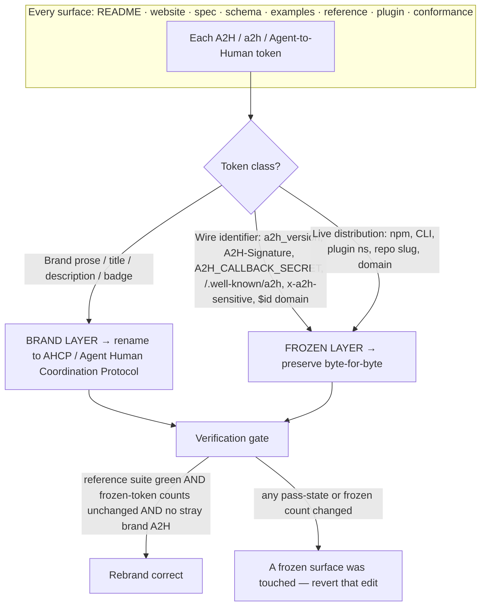
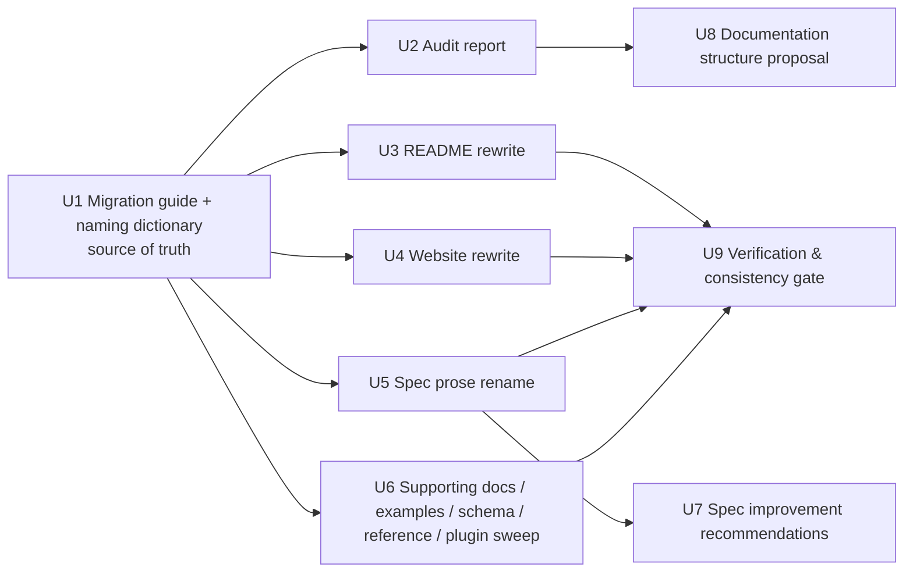

# Plan — AHCP Rebrand & Specification Overhaul (A2H → AHCP)

## Summary

Rebrand the protocol's **display name** from **A2H / Agent-to-Human Protocol** to
**AHCP / Agent Human Coordination Protocol** everywhere it appears as prose, headings, titles,
descriptions, and badges — across the README, website, specification, examples, schemas, reference,
plugin, and conformance docs — and mature the documentation so a reader finding the repo three years
from now understands the problem, the protocol, why it exists, and how to implement it without
contacting the original author.

The single governing constraint: **this is a naming, clarity, and positioning change only — it must
not bump a version or alter protocol semantics.** That makes the rebrand a **token-class-aware**
transformation, not a find-replace. A naive `s/A2H/AHCP/` would rewrite the wire-level HTTP header
`A2H-Signature`, the env var `A2H_CALLBACK_SECRET`, the `a2h_version` field, the `/.well-known/a2h`
discovery path, the `x-a2h-sensitive` schema extension, and the `a2hprotocol.org` schema `$id` domain
— each of which is frozen protocol surface whose change *would* be a breaking version bump and *would*
break the existing conformance vectors and the OH HAI reference implementation. The plan separates a
**brand layer** (rename freely) from a **frozen identifier layer** (preserve exactly), and uses the
existing reference test suite + conformance vectors as the objective verification gate that proves no
frozen surface moved.

Alongside the rename, the plan removes/relocates internal-founder, commercial, and brainstorming
language (e.g. the README "Name (locked)" rejected-names rationale, the "Autonomy sells the best
implementation" positioning, the "Path to official" strategy), fixes a stale version pointer
(docs say v0.2 is current; the CHANGELOG shows v0.3 Draft is current), and produces six requested
deliverables.

---

## Problem Frame

The repository presents a real, in-use coordination protocol under the name **A2H — Agent-to-Human
Protocol**. The presentation has three problems the rebrand must fix:

1. **Naming.** The protocol should be named **AHCP — Agent Human Coordination Protocol**, used
   consistently across every human-readable surface. But the codename `a2h` and the token `A2H` are
   woven into both *brand prose* (safe to rename) and *frozen wire identifiers* (must not change).
   The boundary between the two is the central engineering problem.

2. **Founder / product voice.** The README and supporting docs carry first-person and commercial
   framing — rejected-name brainstorming, "oh hai" meme rationale, "Autonomy authors the standard
   *and* sells the best implementation", a go-to-market "Path to official". These read as internal
   notes, not protocol documentation, and several are now self-contradictory after the rename.

3. **Drift.** The README header and website advertise **Version 0.2 / spec v0.2 as current**, while
   the CHANGELOG and `spec/v0.3.md` show **v0.3 (Draft) is current** (recent merges #7–#10). Other
   ambiguities and terminology inconsistencies exist in the spec that should be *reported*, not
   silently redesigned.

The work must leave protocol semantics byte-identical and produce mature, author-independent docs.

---

## Requirements

Traceable to the six stated objectives and the hard constraints.

| ID | Requirement | Source |
|----|-------------|--------|
| R1 | Produce a repository audit report enumerating internal/founder/scrappy content and its disposition (remove / rewrite / relocate / rename / freeze). | Objective 1 |
| R2 | Rewrite the README in concise RFC/standards tone: problem, protocol, notify/ask/task, the Hub's role, why AHCP exists, use cases, non-goals. | Objective 2 |
| R3 | Rewrite all public-facing website copy: professional, protocol-first, vendor-neutral, implementation-agnostic; no hype, no AI buzzwords. | Objective 3 |
| R4 | Review the specification and report ambiguities, inconsistencies, terminology/naming drift, and clarity opportunities — **without redesigning** the protocol or adding concepts. | Objective 4 |
| R5 | Strengthen positioning around "AHCP standardizes how autonomous agents coordinate with humans" (fleets, decision points, task execution, durable coordination, central hub, runtime/model/implementation neutrality). | Objective 5 |
| R6 | Deliver: (1) audit report, (2) updated README, (3) updated website copy, (4) suggested documentation structure, (5) spec improvement recommendations, (6) A2H→AHCP migration guide. | Objective 6 |
| R7 | Rename the display brand **A2H → AHCP** and **Agent-to-Human Protocol → Agent Human Coordination Protocol** consistently across README, website, spec, examples, diagrams, references, API docs, badges, project descriptions. | Naming Change |
| C1 | **Do not change protocol semantics, add features, redesign, or simplify away concepts.** | Constraint |
| C2 | **Do nothing that requires a version bump.** The spec implementation must not change at all — only clarity and naming. Every frozen wire identifier is preserved exactly. | Constraint |
| C3 | Treat OH HAI as a complete, in-use reference implementation; do not break live distribution surfaces (npm package, CLI, plugin namespace, repo slug, domain). | Constraint |
| C4 | Remove internal-founder language; write so the docs survive without the original author. | Guidance 1–3 |

**Verification oracle for C1/C2:** the reference test suite (`reference/`, vitest) and the conformance
vectors (`conformance/vectors/`) must remain green and byte-unchanged in their wire-relevant content
after the rebrand. If any pass-state changes, a frozen identifier was touched — the rename is wrong.

---

## Key Technical Decisions

### KTD-1 — Two-layer rename: brand layer renames, frozen-identifier layer is preserved

The rebrand operates on a **brand layer** only. Every token below is classified once, in the
migration guide's naming dictionary (U1), and every later unit keys off that classification.

**Rename (brand layer — human-readable name of the protocol):**

- `A2H` standalone → `AHCP`
- `A2H — Agent-to-Human Protocol` → `AHCP — Agent Human Coordination Protocol`
- `Agent-to-Human Protocol` / `Agent-to-Human` *as the proper-noun protocol name* → `Agent Human Coordination Protocol`
- Brand mentions in titles, headings, meta tags, JSON-LD `name`/`description`, schema `title`/`description`, badges, package/plugin **descriptions** and **keywords prose**, favicon text.

**Preserve exactly (frozen layer — changing any of these is a version bump / breaking change, forbidden by C2/C3):**

| Frozen token | Kind | Why frozen | Approx. count |
|--------------|------|-----------|---------------|
| `a2h_version` | message field name (wire) | Carried in every message; renaming breaks all parsers + every example/vector. | 110 |
| `A2H-Signature` | HTTP response header (§9.2) | Part of the signature scheme; renaming breaks callback verification + `dp-001`/`sv-005`/`sv-006`. | 24 |
| `A2H_CALLBACK_SECRET` | env var convention (§8.3) | Referenced by `secret_ref` examples + vectors. | 6 |
| `/.well-known/a2h` | discovery path (§8.0) | Wire endpoint; renaming breaks discovery. | 12 |
| `x-a2h-sensitive` | JSON-Schema extension field | Used in message schema + `ask-sensitive-field` example. | — |
| `a2hprotocol.org` | schema `$id` domain + canonical URLs | CONTRIBUTING states a non-breaking change keeps the existing `$id`; changing the domain re-keys every `$id`. | many |
| `@a2h/reference`, `a2h` (CLI binary) | npm package + CLI name | Live distribution (C3); renaming breaks installs/scripts. | — |
| `a2h-skills` (plugin), `@a2h` (marketplace), `/plugin install a2h-skills@a2h`, `plugins/a2h-skills/` | plugin namespace + path | Live install flow; renaming the dir/namespace breaks existing installs. | — |
| `autnmy/a2h-protocol`, `github.com/autnmy/a2h-protocol/...` | GitHub repo slug + URLs | External infra; a docs PR cannot rename the repo, and stale URLs would 404. | many |

**Disambiguation rule for the descriptive phrase "agent-to-human":** when `agent-to-human` /
`agent ↔ human` is used as a *descriptive direction* ("AHCP standardizes how agents coordinate with
humans", "the agent↔human complement to A2A"), it stays as plain English. Only the *proper-noun
protocol name* "Agent-to-Human Protocol" is renamed. The family diagram line `A2H → agent ↔ human`
becomes `AHCP → agent ↔ human` (brand token renamed; the arrow phrase is descriptive and stays).

### KTD-2 — `a2h` codename survives as the frozen wire/distribution slug; "AHCP" is the brand

The lowercase `a2h` is the protocol's frozen wire+distribution slug (`a2h_version`, `/.well-known/a2h`,
npm, CLI, plugin, domain). This is intentional and common in shipped protocols: the brand can mature
while the on-the-wire constant stays frozen for compatibility. The plan does **not** try to reconcile
these — it documents the relationship in the migration guide and leaves a future, separately-versioned
cleanup (renaming the CLI/npm/plugin) as an explicit non-goal here.

### KTD-3 — Deliverables 1/4/5/6 are new advisory docs; 2/3 are in-place rewrites

- New files (reports/guides): migration guide, audit report, documentation-structure proposal,
  spec-improvement recommendations.
- In-place rewrites: `README.md`, `index.html` (+ `favicon.svg`), spec prose, supporting docs.
- The spec review (R4) produces a **recommendations document only** — it does **not** edit spec
  normative content beyond the brand rename (C1).

### KTD-4 — Superseded specs get the cosmetic brand rename only

`spec/v0.1.md` and `spec/v0.2.md` are historical/superseded. They receive the same brand-prose rename
for consistency (so the name is uniform repo-wide), but their version numbers, frozen identifiers, and
normative content are untouched. The brand rename to a historical spec changes only the display name,
not the snapshot it records.

### KTD-5 — Fix the stale version pointer as a clarity change (not a semantic one)

The CHANGELOG shows **v0.3 (Draft)** is current; README/website say v0.2. Updating the "current
version / current spec" pointers (status stays **Draft**, version → 0.3, spec link → `spec/v0.3.md`)
is a documentation-accuracy fix, not a protocol change, and directly serves the "discoverable in 3
years" goal. It is applied in the README/website rewrites and recorded in the audit. No `a2h_version`
value or schema is changed.

### KTD-6 — Relocate, don't delete, the governance/commercial content

Founder/commercial/strategy passages that don't belong in protocol docs (commercial positioning,
go-to-market roadmap) are **relocated** to `GOVERNANCE.md` in neutral third-person form rather than
deleted, preserving institutional intent while keeping the README protocol-first. Pure brainstorming
that is now self-contradictory (the "Name (locked)" rejected-names section, the "oh hai" meme) is
**removed** and replaced with a short neutral "Name" note.

---

## High-Level Technical Design

### The two-layer model



### The rebrand pipeline (unit flow)



---

## Output Structure

New documentation artifacts created by this plan (existing files edited in place are not shown):

```
MIGRATION.md                                  ← U1: A2H→AHCP migration guide + authoritative naming dictionary
docs/
  ahcp-rebrand-audit.md                       ← U2: repository audit report (disposition table)
  documentation-structure.md                  ← U8: suggested mature doc structure
  spec-improvement-recommendations.md         ← U7: advisory spec review (no semantic edits)
  plans/
    2026-06-20-001-refactor-ahcp-rebrand-spec-overhaul-plan.md  ← this plan
```

The per-unit **Files** lists remain authoritative for what each unit creates or modifies.

---

## Assumptions

Headless/pipeline run — the following bets were made without a confirmation round and are surfaced
for the reviewer to correct:

- **A1.** "AHCP" and "Agent Human Coordination Protocol" are the final, approved names (given verbatim
  in the request). No alternative casing/spacing (e.g. "Agent–Human") is intended.
- **A2.** The `a2h` wire/distribution slug (field, path, npm, CLI, plugin, domain, repo) **stays
  frozen**; renaming it is out of scope here because it would break the in-use reference impl and
  require a version bump (C2/C3). If the intent was a *full* infrastructure rename, that is a separate,
  versioned effort (see Scope Boundaries → Deferred).
- **A3.** v0.3 (Draft) is the current version (per CHANGELOG + merges #7–#10), so the stale v0.2
  pointers are corrected to v0.3 while keeping status "Draft".
- **A4.** New deliverable docs live at the repo paths in Output Structure; reviewers may relocate.
- **A5.** `og.png` (binary social card showing "A2H") cannot be precisely edited as text; regenerating
  the rendered artwork is flagged but deferred (see Scope Boundaries).

---

## Scope Boundaries

### In scope
- Brand-layer rename across all human-readable surfaces (R7).
- README + website rewrites (R2, R3, R5).
- Removal/relocation of internal-founder/commercial/brainstorm language (C4, KTD-6).
- Stale version-pointer fix (KTD-5).
- The six deliverable documents (R6).
- Verification that no frozen identifier or test outcome changed (C1, C2).

### Deferred to Follow-Up Work
- **Renaming the live distribution slug** (`@a2h/reference` npm package, `a2h` CLI binary,
  `plugins/a2h-skills/` directory + `a2h-skills` plugin namespace, `autnmy/a2h-protocol` repo slug,
  `a2hprotocol.org` domain). Each is a breaking change for existing users and/or requires a coordinated
  version bump — out of bounds under C2/C3. Document the brand↔slug relationship in MIGRATION.md and
  leave the slug rename to a future versioned release.
- **Regenerating `og.png`** (and any other rendered raster art) to show "AHCP". Flagged in the audit;
  requires image tooling/design, not a text edit.
- **Acting on the spec-improvement recommendations** (U7) beyond naming — those are advisory for a
  future spec revision, not applied here (C1).

### Non-goals (out of this product's identity)
- Changing any protocol semantics, message shape, signature scheme, lifecycle, or version number.
- Adding features, endpoints, verbs, or concepts.
- Editing superseded specs' normative content (only their display brand changes — KTD-4).
- Marketing/growth copy — the website becomes infrastructure documentation, not a pitch.

---

## Implementation Units

### U1. Migration guide + authoritative naming dictionary

**Goal:** Establish the single source of truth for the whole rebrand: a human migration guide
(A2H→AHCP) that doubles as the canonical **naming dictionary** — the exact rename map and the frozen
identifier registry — that every later unit applies. (Deliverable 6.)

**Requirements:** R6, R7, C2, C3, KTD-1, KTD-2.

**Dependencies:** none (must land first).

**Files:**
- `MIGRATION.md` (new)

**Approach:**
- Two tables, lifted from KTD-1: **"Rename these"** (brand tokens → new brand) and **"Never rename
  these"** (frozen wire + distribution registry, with the one-line reason each is frozen).
- A short "What changed and what didn't" narrative for adopters: the *name* is now AHCP; the *wire
  format, version, schemas, endpoints, package, CLI, and plugin are unchanged* — **no code change is
  required to stay conformant**, no `a2h_version` bump.
- The disambiguation rule for the descriptive phrase "agent-to-human" (KTD-1).
- A note recording the brand↔slug relationship and pointing the eventual slug rename to a future
  versioned release (KTD-2, Scope→Deferred).

**Patterns to follow:** `CONTRIBUTING.md` versioning section (it already states the `$id`/path
freeze rule); match the repo's terse, normative doc voice.

**Test scenarios:** Test expectation: none — documentation artifact. Consistency check: every token in
the "Never rename" table is one that actually appears in the repo (cross-checked by U9 grep counts).

**Verification:** `MIGRATION.md` exists; the frozen registry matches the U9 grep inventory exactly
(no frozen token missing, none mislabeled as brand).

---

### U2. Repository audit report

**Goal:** Produce the audit deliverable: an enumerated, file-referenced disposition of every internal
note, founder/commercial passage, brainstorming fragment, scrappy phrasing, stale pointer, brand-rename
site, and frozen identifier — each marked **remove / rewrite / relocate / rename / freeze**. (Deliverable 1.)

**Requirements:** R1, R6, C4, KTD-5, KTD-6.

**Dependencies:** U1 (uses the naming dictionary's token classes).

**Files:**
- `docs/ahcp-rebrand-audit.md` (new)

**Approach:**
- A disposition table keyed by `file:line`, grouped: (a) internal-founder/commercial/brainstorm
  language (e.g. README "Name (locked)", "Autonomy sells the best implementation", "Path to official",
  "Adoption first, governance second"; NOTICE commercial line — assess keep/relocate); (b) version
  drift (README/website v0.2 vs CHANGELOG v0.3); (c) brand-rename inventory by surface; (d) frozen
  identifiers that must NOT change; (e) binary/raster assets needing regeneration (`og.png`).
- Each row states the disposition and the target (for relocations, name the destination doc).
- The audit is the rationale-of-record for U3–U6; it does not itself edit code.

**Patterns to follow:** existing `docs/plans/*.md` table style.

**Test scenarios:** Test expectation: none — report artifact. Completeness check: every founder/marketing
hit from the planning scan and every frozen token appears in the report with a disposition.

**Verification:** Report enumerates ≥ all founder/commercial passages found in the planning scan, the
version drift, and the full frozen registry; no row lacks a disposition.

---

### U3. Rewrite the README (RFC tone) + relocate founder/commercial content

**Goal:** Replace the README with a concise, standards-tone document and apply the brand rename.
(Deliverables 2 + part of 5.)

**Requirements:** R2, R5, R7, C4, KTD-3, KTD-5, KTD-6.

**Dependencies:** U1, U2.

**Files:**
- `README.md` (rewrite)
- `GOVERNANCE.md` (receive relocated commercial/strategy content in neutral form)
- `CHANGELOG.md` (add an `Unreleased` note: documentation rebrand A2H→AHCP, naming only, no
  `a2h_version` change)

**Approach:**
- Structure (RFC/standards register, no hype): one-line definition → Problem → Protocol overview →
  The three verbs (notify/ask/task) → The Hub's role (inbox, routing, persistence, decision
  collection) → Why AHCP exists → Use cases → Non-goals → Conformance/spec/schema pointers →
  Stewardship (neutral) → License.
- Positioning sentence (R5): "AHCP standardizes how autonomous agents coordinate with humans"; keep
  the MCP/A2A family framing as orientation, with the brand line `AHCP → agent ↔ human`.
- Header badge line: status **Draft**, version **0.3**, steward, license (KTD-5).
- Brand rename per U1; preserve frozen tokens in the repo-layout block (`/.well-known/a2h`,
  `@a2h/reference`, `a2h` CLI, `plugins/a2h-skills/`) exactly.
- **Remove** the "Name (locked)" rejected-names/"oh hai" section → replace with a 2–3 line neutral
  "Name" note (AHCP = Agent Human Coordination Protocol; complements A2A/MCP).
- **Relocate** "Autonomy authors the standard *and* sells the best implementation", the
  protocol-vs-product commercial table, and the "Path to official" roadmap into `GOVERNANCE.md`
  as neutral third-person stewardship notes (KTD-6).
- Soften competitive prior-art prose (named vendors) into neutral "related work / prior art" framing
  while keeping the substantive "why this exists" gap analysis.

**Patterns to follow:** current README's table formatting for the three verbs and provenance; the
spec's normative voice.

**Test scenarios:** Test expectation: none — documentation. Checks: no `A2H` brand token remains in
`README.md` except inside frozen identifiers; version pointers read 0.3/`spec/v0.3.md`; no first-person
or commercial-pitch sentences remain; relocated content present in `GOVERNANCE.md`.

**Verification:** `grep -nE 'A2H|Agent-to-Human' README.md` returns only frozen-identifier lines (e.g.
`A2H-Signature`, `A2H_CALLBACK_SECRET`, `.well-known/a2h`, `@a2h`); README reads as protocol-first.

---

### U4. Rewrite the website copy + brand rename in `index.html`

**Goal:** Make the site read as infrastructure documentation: professional, protocol-first,
vendor-neutral, no hype/AI-buzzwords; apply the brand rename to all visible copy and metadata.
(Deliverable 3 + part of 5.)

**Requirements:** R3, R5, R7, KTD-1, KTD-5.

**Dependencies:** U1.

**Files:**
- `index.html` (rewrite visible copy + metadata)
- `favicon.svg` (rename the one `A2H` text token)

**Approach:**
- **Visible brand:** title bar `a2h — agent-to-human protocol` → `AHCP — Agent Human Coordination
  Protocol`; hero `<h1>` `A2H — Agent-to-Human Protocol` → AHCP; tagline and family diagram line
  (`A2H → agent ↔ human` → `AHCP → agent ↔ human`).
- **Metadata:** `<title>`, `<meta name=description>`, OpenGraph/Twitter `title`/`description`, JSON-LD
  `name`/`alternateName`/`description`, sitemap/robots unaffected (URLs only). Rename brand text; keep
  all `a2hprotocol.org` and `github.com/autnmy/a2h-protocol` **URLs** unchanged (frozen).
- **CLI demo tokens stay frozen:** the interactive terminal's `a2h about`, `a2h verbs`, `a2h docs`,
  `a2h rules`, `a2h skills`, `a2h run-vectors`, the `~/a2h` prompt, and the `/plugin install
  a2h-skills@a2h` line mirror the real CLI/plugin and are part of the frozen distribution layer — do
  **not** rename them. Add a one-line note in U2's audit recording this intentional brand↔CLI split.
- **Spec link** updated v0.2 → v0.3 (KTD-5).
- Rewrite any hype/marketing phrasing into neutral protocol description; remove AI-buzzword framing.
- `favicon.svg`: rename the visible `A2H` text token to the new mark (keep geometry).
- Flag `og.png` for regeneration in the audit (deferred — binary).

**Patterns to follow:** keep the existing terminal aesthetic and structure; change copy, not layout
or the demo's command grammar.

**Test scenarios:** Test expectation: none — static site. Checks: visible brand and metadata read
AHCP; all `a2hprotocol.org`/GitHub URLs intact; CLI demo tokens unchanged; spec link points to v0.3.

**Verification:** Rendered/inspected `index.html` shows "AHCP — Agent Human Coordination Protocol"
in title bar, hero, and metadata; `grep -nE 'agent-to-human protocol|A2H — Agent-to-Human'`
returns nothing in visible copy; URL/CLI tokens preserved.

---

### U5. Apply the brand rename to the specification prose (all versions)

**Goal:** Rename the protocol's display name in spec prose/titles/headings while freezing every
normative wire identifier. (Part of R7; supports R4.)

**Requirements:** R7, C1, C2, KTD-1, KTD-4.

**Dependencies:** U1.

**Files:**
- `spec/v0.3.md` (current — full brand rename)
- `spec/v0.2.md`, `spec/v0.1.md` (superseded — cosmetic brand rename only, KTD-4)

**Approach:**
- Rename title `# A2H — Agent-to-Human Protocol` → `# AHCP — Agent Human Coordination Protocol`;
  abstract and prose `A2H` (as the protocol name) → `AHCP`; provenance table header "Reused in A2H"
  → "Reused in AHCP".
- **Freeze, verbatim:** `a2h_version`, `A2H-Signature` (§9.2), `A2H_CALLBACK_SECRET` (§8.3),
  `/.well-known/a2h` (§8.0), `x-a2h-sensitive`, `$id` URLs at `a2hprotocol.org`, all
  `github.com/autnmy/a2h-protocol` links, and any wire field/header/path names. Apply KTD-1's
  disambiguation: descriptive "agent↔human" stays; the proper-noun name renames.
- Do **not** alter section numbering, normative MUST/SHOULD content, examples' wire fields, or version
  strings (C1). The brand rename to v0.1/v0.2 changes only the display name on a historical snapshot.

**Patterns to follow:** the spec's own normative register; leave RFC-2119 keywords and structure intact.

**Test scenarios:** Test expectation: none — spec prose. Checks: §8.0/§8.3/§9.2 frozen tokens
byte-unchanged; no normative sentence altered beyond the brand noun; version strings unchanged.

**Verification:** `grep -nE 'A2H-Signature|A2H_CALLBACK_SECRET|a2h_version|\.well-known/a2h|x-a2h-sensitive'
spec/v0.3.md` count equals the pre-edit count; `git diff` shows only brand-noun and title changes.

---

### U6. Brand-rename sweep across supporting docs, examples, schemas, reference, plugin, conformance

**Goal:** Apply the brand rename to every remaining surface's *prose/description/comment* tokens while
freezing all wire and distribution content. (Completes R7.)

**Requirements:** R7, C1, C2, C3, KTD-1, KTD-2.

**Dependencies:** U1.

**Files (prose/description/comment-level brand tokens only):**
- Root docs: `CONTRIBUTING.md`, `GOVERNANCE.md`, `NOTICE`, `CHANGELOG.md` (title line "changes to the
  A2H Protocol specification" → AHCP; keep historical entries' wording intact).
- `.github/PULL_REQUEST_TEMPLATE.md`, `.github/ISSUE_TEMPLATE/spec-change-proposal.md`.
- `conformance/README.md`, `reference/README.md`.
- `examples/callback-anti-pattern.md`, `examples/response-signature-v0.3.md` (Markdown prose only;
  **no JSON example's `a2h_version`/header/field values change**).
- `schema/v0.1|v0.2|v0.3/*.json`: rename brand only inside `title`/`description` string values; **freeze
  `$id`, `$schema`, property names, `x-a2h-sensitive`, `/.well-known/a2h`, `a2h_version`**.
- `reference/src/*.ts`, `reference/bin/a2h.ts`, `reference/demo/playground.ts`: rename brand only in
  user-facing strings/comments; **freeze all identifiers, the `a2h` CLI name, header/field constants,
  and import paths** (the test suite is the guardrail).
- `plugins/a2h-skills/**/*.md`, `plugins/a2h-skills/.claude-plugin/plugin.json`,
  `.claude-plugin/marketplace.json`: rename brand in **descriptions/keywords prose**; **freeze plugin
  `name` `a2h-skills`, marketplace `@a2h`, install commands, `a2h_version`, `/.well-known/a2h`, and all
  URLs** (C3).
- `conformance/vectors/*.json`: **freeze entirely** — these are wire fixtures; the only permissible
  edit is a non-wire human label/comment field if one exists, otherwise no change.

**Approach:** Walk each file applying U1's rename map strictly to brand prose; never touch a token in
the frozen registry. JSON `$id`/property/field values and all vector payloads are off-limits. Where a
file is purely wire (conformance vectors, schema property names), the expected diff is empty.

**Patterns to follow:** U1 naming dictionary is authoritative; when unsure whether a token is brand or
frozen, treat it as frozen and record the question in the audit.

**Test scenarios:**
- Covers C2. After the sweep, `cd reference && npm test` is **green** (proves no identifier/CLI/import
  was renamed).
- Conformance vectors are byte-identical in all wire fields.
- Schema `$id` values unchanged across `schema/**`.
- Plugin `name`/marketplace/install tokens unchanged.

**Verification:** reference suite green; `git diff` on `schema/**`, `conformance/**`, and
`reference/src/**` shows no identifier, `$id`, field-name, header, path, or import change — only brand
strings/comments/descriptions.

---

### U7. Spec improvement recommendations (advisory)

**Goal:** Deliver the spec review: a report of ambiguities, inconsistencies, terminology/naming drift,
and clarity opportunities — explicitly **without** redesigning the protocol. (Deliverable 5.)

**Requirements:** R4, R6, C1.

**Dependencies:** U5 (informed by the full spec read).

**Files:**
- `docs/spec-improvement-recommendations.md` (new)

**Approach:**
- Catalog, with `spec/v0.3.md §` references and severity: terminology drift (e.g. "spoke"/agent,
  "verb"/"message type" usage), any ambiguous MUST/SHOULD phrasing, cross-reference/version-pointer
  drift (the v0.2↔v0.3 issue), section-organization clarity opportunities, and naming consistency
  (brand vs frozen slug — explain the intentional split so future editors don't "fix" it into a
  breaking change).
- Each item: observation → why it's ambiguous/inconsistent → suggested clarification → explicit note
  that it is advisory and **not applied** here (no semantic change, no version bump).

**Patterns to follow:** the repo's `docs/plans` "Key finding" framing — precise, scoped, evidence-led.

**Test scenarios:** Test expectation: none — advisory report. Check: every item cites a spec section
and is clarity-only (no item proposes a wire/semantic change without flagging it as out-of-scope).

**Verification:** Report exists, is section-referenced, and contains no recommendation that would
require a version bump without labeling it as future/out-of-scope.

---

### U8. Suggested documentation structure

**Goal:** Propose the mature, author-independent documentation layout. (Deliverable 4.)

**Requirements:** R6, C4 (survives without the author).

**Dependencies:** U2.

**Files:**
- `docs/documentation-structure.md` (new)

**Approach:**
- Propose an information architecture for a serious protocol project: landing/README → Overview/Why →
  Spec (versioned) → Schemas → Examples → Conformance → Reference implementation → Plugin/adoption →
  Migration → Governance/Contributing. Map existing files into it; note gaps (e.g. a stable "current
  version" entry point, a "Getting started / implement a Hub in 10 minutes" path) as recommendations.
- Keep it a *proposal* — it does not move files in this plan (relocations beyond U3's are advisory).

**Test scenarios:** Test expectation: none — advisory report.

**Verification:** Report exists; every current top-level doc is placed in the proposed structure; gaps
are called out.

---

### U9. Verification & consistency gate

**Goal:** Prove the rebrand is complete on the brand layer and inert on the frozen layer — the C1/C2
safety gate.

**Requirements:** C1, C2, C3, R7.

**Dependencies:** U3, U4, U5, U6.

**Files:** none (verification unit).

**Approach — run and record:**
1. **Frozen-count invariance.** Re-run the frozen-token inventory and assert counts are unchanged
   vs. the pre-rebrand baseline: `a2h_version` (110), `A2H-Signature` (24), `A2H_CALLBACK_SECRET` (6),
   `/.well-known/a2h` (12), `x-a2h-sensitive`, `$id` domain, plugin/marketplace/install tokens, and
   `github.com/autnmy/a2h-protocol` URLs.
2. **Reference suite.** `cd reference && npm test` — must be green (guards every renamed code string
   against accidentally touching an identifier/import/CLI name).
3. **Vector/schema diff.** `git diff --stat conformance/ schema/` shows only `title`/`description`
   string changes (or empty for vectors); no `$id`/property/field change.
4. **Brand-completeness.** `grep -rnE 'A2H|Agent-to-Human'` over the repo returns **only** frozen
   identifiers (`A2H-Signature`, `A2H_CALLBACK_SECRET`, `.well-known/a2h`, `@a2h`, `a2h-skills`,
   `a2h_version`, `a2hprotocol.org`, `autnmy/a2h-protocol`) — any remaining *brand* `A2H`/`Agent-to-Human`
   is a miss to fix.
5. Record results in the audit (U2) as the closing "verification" section.

**Test scenarios:**
- All four assertions above pass.
- A deliberate spot-check: `dp-001-signature.json` and `signing.test.ts` unchanged → signature scheme
  intact.

**Verification:** reference suite green; frozen counts equal baseline; brand grep clean except frozen
tokens; results recorded.

---

## Risks & Dependencies

| Risk | Impact | Mitigation |
|------|--------|-----------|
| Blind find-replace renames a frozen identifier (`A2H-Signature`, `a2h_version`, `$id` domain). | Breaks signature scheme / parsers / conformance vectors → silent version bump, violates C2. | KTD-1 token-class classification in U1; U6 freezes wire/distribution tokens; U9 reference suite + frozen-count gate catches any slip. |
| Renaming the npm/CLI/plugin/repo/domain slug. | Breaks live installs and the OH HAI reference impl (C3). | Explicit Deferred/Non-goal; U1 documents the brand↔slug split; CLI demo tokens on the site frozen (U4). |
| Over-editing the spec (clarity edits that change normative meaning). | Violates C1/redesign ban. | U5 is brand-rename-only; U7 is advisory and explicitly not-applied; `git diff` review. |
| Stale version pointer "corrected" to a version that isn't actually current. | Misrepresents protocol status. | KTD-5 keys the fix to CHANGELOG evidence (v0.3 Draft); status stays "Draft". |
| `og.png` still shows "A2H" after launch. | Visible brand inconsistency on social cards. | Flagged in audit; deferred with explicit owner action (regenerate art). |
| Relocated commercial content loses intent or lands in the wrong doc. | Governance gap. | KTD-6 relocates (not deletes) into `GOVERNANCE.md` in neutral form; audit records source→destination. |

**External dependency:** `reference/` test suite must be runnable (`npm install` available) for the U9
gate. If unavailable in the execution environment, U9 falls back to the static frozen-count + diff
assertions and records the suite as not-run.

---

## System-Wide Impact

- **Adopters / implementers:** zero code impact — the wire format, version, schemas, endpoints, npm
  package, CLI, and plugin are unchanged. MIGRATION.md states this explicitly so no one re-implements.
- **Search/discoverability:** brand changes to AHCP across README/site/spec; URLs and repo slug
  unchanged, so existing links keep working.
- **Maintainers:** the audit + naming dictionary + spec recommendations give future editors the
  brand↔frozen boundary in writing, preventing a future "consistency fix" from becoming a breaking change.

---

## Sources & Research

- Local scan: 195 `A2H`, 336 `a2h`, 26 `Agent-to-Human`, 0 existing `AHCP` across the repo.
- Frozen-identifier evidence: `spec/v0.3.md` §8.0 (`/.well-known/a2h`), §8.3 (`A2H_CALLBACK_SECRET`),
  §9.2 (`A2H-Signature`); `a2h_version` (110 hits); `x-a2h-sensitive` in schema + examples;
  `CONTRIBUTING.md` `$id`/path freeze rule.
- Version drift evidence: `README.md:3` & `index.html:258` (v0.2) vs `CHANGELOG.md` (v0.3 Draft,
  2026-06-12) and merges #7–#10.
- Founder/commercial language: `README.md` "Name (locked)", "Autonomy … sells the best
  implementation", "Path to official", protocol-vs-product table; `NOTICE` commercial line.
- Verification oracle: `reference/test/*.test.ts` (incl. `conformance.test.ts`, `signing.test.ts`) and
  `conformance/vectors/*.json`.
