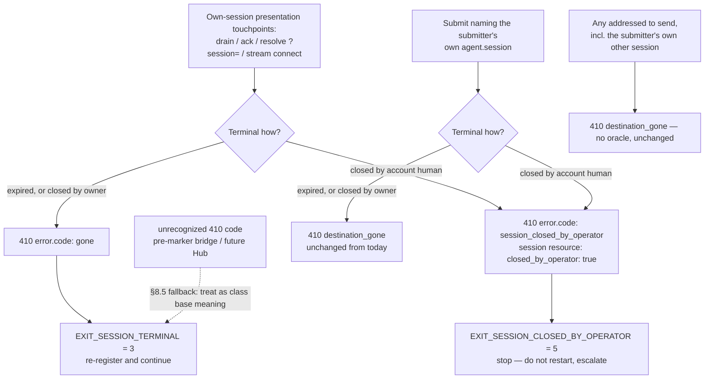

# feat: shared MAC helpers, canonical version constant, v0.5 marker formalization, vendored-surface re-sync

## Summary

Implements issue #41 (folding in #37). One pass restores the reference as the single source of truth for the surfaces downstream (`autnmy/oh-hai`) vendors byte-for-byte: export the MAC decode/validate rule beside the signer that emits it, export one canonical wire-version constant, re-sync `types.ts` with `schema/v0.5`, formalize the two v0.5 markers a shipping Hub already emits (explicit delivery-record `prior`, operator-close), and move the reference bridge loop and ma2h.org with them so nothing describes the pre-marker world after the spec moves.

---

## Problem Frame

Wire rules with two implementations drift. Downstream hand-rolled a second MAC validator with the wrong alphabet and rejected 100% of conformant traffic (oh-hai#711); it declares the wire version in five places and now advertises `v0.3` while emitting `0.5` (oh-hai#712); its Hub ships `delivery.prior` and operator-close markers the schema doesn't admit (oh-hai#700). Each gap has the same fix: put the one canonical definition in the vendored reference surface so consumers import instead of re-derive. Ordering constraint from the issue: schema/spec → reference loop → website, and this must land before oh-hai#712 re-vendors.

---

## Requirements

**Shared MAC rule**

- R1. `reference/src/signing.ts` exports `isWellFormedMac(v1: string): boolean` and `decodeMac(v1: string): Buffer | null`.
- R2. `verifyCanonical` consumes `decodeMac`, so all six `verify*` contexts share the one definition.
- R3. Screening is exactly: base64url alphabet, optional RFC 4648 padding tolerated only when structurally valid (pad count exactly `(4 − unpadded_length mod 4) mod 4`, i.e. padded total length ≡ 0 mod 4), decoded length ≥ 32 bytes — and stops there (no canonical round-trip enforcement; a 43-char hex-looking MAC is valid).
- R4. Signing output and the `examples/entry-signatures-v0.5.md` fixtures stay byte-for-byte unchanged.

**Canonical version constant**

- R5. One exported constant (`MA2H_VERSION = "0.5"`) exists in a vendored `reference/src` module.
- R6. The reference uses it internally — `hub.ts`'s private `HUB_VERSION` literal is replaced by the import; every Hub-minted envelope carries it.
- R7. §10 negotiation and the §9.2 push-parity floor are byte-unchanged; `PAYLOAD_BOUND_SINCE_MINOR = 3` stays anchored at the signature-break minor.

**types.ts re-sync (#37)**

- R8. `Capability["inbound"]` gains `session_param`, `stream_url`, `stream_max_hold_seconds`; `Capability["rate_limit"]` gains `inter_agent_requests_per_minute` (the remaining schema-vs-type gap found in research).
- R9. `SubmitAck.status` widens to the schema's full 11-value enum.
- R10. No exported type or function is renamed — after landing, oh-hai's re-vendor can restore `signing.ts` and `types.ts` to byte-identical.

**v0.5 marker formalization**

- R11. `schema/v0.5/get-message.schema.json` gains an additive `mailbox.prior` (enum `queued`|`delivered`) with consistency conditionals: `prior` present ⇒ `state: "bounced"`; `prior: "queued"` ⇒ `delivered_at` absent. It lands on the **mailbox** track object — not the response-track `delivery` object, where `queued|delivered` is meaningless. `prior: "delivered"` SHOULD co-occur with `delivered_at` (spec sentence + `$comment`), deliberately not schema-required — a Hub that knows an entry was delivered but no longer retains the timestamp must still be able to state `prior` truthfully rather than fall back to the never-seen inference.
- R12. `schema/v0.5/session.schema.json` gains an additive `closed_by_operator` typed `"const": true` (matching the true-only emission rule and the `?: true` TypeScript type — a `boolean` type would let `false` validate while the spec says `false` must never be emitted) with the conditional `closed_by_operator` present ⇒ `state: "closed"`.
- R13. Spec §8.5 gains the `session_closed_by_operator` error code (410 class) and a generic fallback rule: within a recognized status class, an unrecognized `code` MUST be treated as the class's base meaning — the new code refines 410, never replaces it.
- R14. Spec §16.3/§16.4 pin the marker semantics: which touchpoints emit the new code, first-terminal-wins immutability, true-only emission, cooperative-within-terminal-retention caveat, no attribution on the bounce receipt or sender's mailbox, and the honest degradation note — the marker is distinguishable only to marker-aware consumers; a pre-marker bridge hits its unmapped-error path and a blanket-restart supervisor re-registers through the kill-switch. §14.2 pins `mailbox.prior` as stamped once at the bounce transition and equal to the bounce receipt's `prior`, and states the rule generically: any surfaced §14.2 delivery record (the message-read mailbox track, or a Hub's directive-delivery view — the surface oh-hai#700 actually ships `prior` on, `GET /v1/directives/{id}`, which upstream does not schematize) SHOULD carry explicit `prior` on `bounced` terminals. All restatement sites of the drain-410 reading are updated (§8.5 ~L685, §8.7.1 ~L744/L764, §8.8 ~L922, §12 ~L1347, §16.3 ~L1817).
- R15. The reference Hub emits both markers per the pinned touchpoint table and stores `prior` on the mailbox record at bounce time rather than re-deriving at read.
- R16. `runBridgeLoop` splits the terminal class: `session_closed_by_operator` → new exit class meaning stop-do-not-restart; `gone` keeps meaning terminal-re-register.
- R17. Conformance vectors cover the new surface (valid + invalid session marker, valid + invalid `mailbox.prior`, MAC well-formedness fixtures) and the prose obligations (dp-019, dp-022, pa-002) name the markers; the coverage map in `conformance/README.md` is updated.
- R18. `index.html`, `reference/README.md`, and `plugins/ma2h-skills` bridge/inbox skills describe the post-marker world — no surviving text presents the collapsed terminal class as deliberate design.

---

## Key Technical Decisions

- **MAC helpers screen alphabet + floor only.** `Buffer.from(v1, "base64url")` is lenient (skips foreign characters — the existing `catch` is dead code), so `decodeMac` does real work: regex the base64url alphabet, accept padding only when structurally valid RFC 4648 (a 43-char value takes exactly one `=`; a 44-char value takes none — anything else is ill-formed, keeping strict decoders in other languages in agreement with the reference), decode, enforce ≥ 32 bytes (HMAC-SHA256 is exactly 32; ed25519 is 64 — floor, not exact). No canonical round-trip check: downstream's earlier stricter draft rejected legitimately valid MACs. One deliberate tightening rides along: standard-base64-alphabet MACs (`+`/`/`) that Node's lenient decoder currently accepts become rejects — conformant §9.2 emitters are unaffected, and a dp-025 fixture pins the flip as an executable decision.
- **One funnel.** All six `verify*` functions already delegate to the private `verifyCanonical`; wiring `decodeMac` there covers §9.2/§9.7/§14.4/§9.8 in one insertion. `signCanonical` is untouched, so emitted signatures cannot change.
- **`MA2H_VERSION` lives in a new `reference/src/version.ts`.** `types.ts` is deliberately type-only (a const is runtime code) and a standalone module is the easiest unit to vendor. `hub.ts` imports it in place of its private `HUB_VERSION`. `PAYLOAD_BOUND_SINCE_MINOR` is a different value with different semantics (the parity floor anchored at minor 3) and is not consolidated — conflating "version this implementation emits" with "accepted floor" is the exact confusion the issue warns about.
- **`prior` is stamped once, at the bounce transition.** `hub.ts` derives both the receipt `prior` and the mailbox answer from `rec.deliveredAtMs` in `bounceEntry`; storing it on the mailbox track record at that moment guarantees the MUST-equal-receipt rule for free. The schema-level home is the mailbox object — the one schematized delivery-record surface with a `bounced` state; the §14.2 spec rule is stated generically so the directive-read emission oh-hai#700 ships (`GET /v1/directives/{id}`, unschematized upstream) is sanctioned in place, with no downstream migration. The reference's own directive-delivery owner view follows the SHOULD only if its track can actually reach `bounced` (implementer verifies; otherwise it keeps `delivered_at`-presence encoding, asymmetry noted).
- **Operator-close marker is additive and cooperative.** True-only emission (set only when the closer is the account human, not the owning principal; absent = not-operator-closed-or-unknown — same rolling-deploy rationale as `prior`). It rides the terminal CAS: a lapsed lease that wins the close race never carries the marker, and a passed `expires_at` never flips a `closed` session to `expired`. Within `terminal_retention_seconds` only; operator close is not credential revocation — say so in §16.4 rather than let readers assume enforcement.
- **Per-touchpoint emission pinned in the §16.3 table.** The marker rides only the caller's own transport context: drain, ack, resolve-with-`?session=`, stream connect, and a submit naming the submitter's own `agent.session` → `session_closed_by_operator` when operator-closed (the caller is the killed party). The own-session submit's **non-operator** terminal case keeps today's `destination_gone` (per the current §16.3 table — it never emitted `gone`, and moving it would be an out-of-scope wire change). Any addressed `to` send — including to the submitter's own other session — and the session-addressed directive throw (`hub.ts` ~L1387, §13.2) stay `destination_gone` regardless of ownership: branching on ownership for `to`-routing is one refactor away from the cross-principal session-state oracle §16.5 guards against.
- **The bounce receipt is untouched.** Its §9.8 digest is a fixed six-key wrapper (`{at, event, id, in_reply_to, prior, session}`); any attribution field would be unsigned and injectable, and extending the digest is a signature break. Consequence named in spec: senders cannot distinguish operator kill from addressee crash — by design.
- **New exit class `EXIT_SESSION_CLOSED_BY_OPERATOR = 5`.** Next free small int in the reference's own sequence (2/3/4 taken; downstream maps to its own supervisor codes, e.g. oh-hai's 14). `mapHubError` must match the new code before `gone`.
- **The §8.5 unknown-code fallback is fail-open by design.** Unrecognized code within a recognized status class → the class's base meaning, matching the HTTP norm. The accepted trade-off: a future stop-semantics 410 refinement degrades to restart for consumers that predate it — exactly as this marker does for pre-marker bridges — in exchange for never crashing or stalling old consumers on additive codes. The spec sentence names the trade-off so the fail-closed alternative is visibly weighed, not silently skipped.
- **Process: direct PR, no version bump.** Non-breaking normative clarification per `CONTRIBUTING.md` (the markers surface contracts already normative in §14.2/§16.4 prose); schema `$id`s stay on `schema/v0.5/` paths; both touched schemas are open objects so old validators pass new fields per §10. CHANGELOG entry under `Unreleased`; every commit DCO-signed (`git commit -s`); PR template's backward-compat + security sections filled.

---

## Assumptions

Defaults adopted where the issue leaves a fork open; each is one sentence in the spec/plan and cheap to reverse in review.

- A submit naming the submitter's own operator-closed `agent.session` returns `session_closed_by_operator` (not `destination_gone`).
- `closed_by_operator` is emitted true-only, never `false`.
- The unknown-code fallback is a generic §8.5 rule (future-proofs later additive codes), not a 410-only note — fail-open by design, with the trade-off named in the spec sentence (see Key Technical Decisions).
- `runBridgeLoop` does not inspect the session returned by its step-4 close: an operator kill after the final drain is indistinguishable from orderly exit, documented as by-design in the loop comment.
- The stale `CURRENT_SPEC=spec/v0.4.md` pin in `scripts/check-frozen-identifiers.sh` is not fixed here (separable, already earmarked as a follow-up; filed at reconcile time).

---

## High-Level Technical Design

The 410 class splits by who terminated the session; everything else in the terminal flow is unchanged.

Delivery order inside the PR mirrors the issue's constraint: schema + spec text first (U4), then the reference Hub/bridge consume the markers (U5), then vectors (U6), then site/README/skills (U7) — the tree never has a state where code or site describe markers the spec lacks.

---

## Implementation Units

### U1. Canonical wire-version constant

- **Goal:** One exported `MA2H_VERSION = "0.5"` the reference itself uses.
- **Requirements:** R5, R6, R7.
- **Dependencies:** none.
- **Files:** `reference/src/version.ts` (new), `reference/src/hub.ts`, `reference/test/version-negotiation.test.ts`.
- **Approach:** New module exporting the constant with a spec-§10-citing doc comment distinguishing "version this implementation emits" from a Hub's accepted floor. Replace `hub.ts`'s private `HUB_VERSION` (L68) with the import; its three envelope-minting uses (response entry, directive, bounce receipt) and the L524 error text follow. Do not touch `PAYLOAD_BOUND_SINCE_MINOR`, the negotiate-before-validate ordering, or `agent.ts`'s regex version gate. `demo/playground.ts`'s `"0.4"` literals are demo-only — out of scope.
- **Patterns to follow:** named-constant-with-doc-comment style of `PAYLOAD_BOUND_SINCE_MINOR` (`hub.ts:75`); `.js`-suffixed ESM imports.
- **Test scenarios:**
  - `MA2H_VERSION` equals `"0.5"` and matches the §10 `0.x` pattern.
  - A Hub-minted response entry / directive / bounce receipt carries `ma2h_version === MA2H_VERSION`.
  - Existing version-negotiation suite green (unknown-major still yields `version_not_supported` before schema validation).
- **Verification:** `npm run typecheck` and `npm test` green in `reference/`.

### U2. Shared MAC decode/validate helpers

- **Goal:** The wire rule for `v1` lives beside the signer that emits it; `verifyCanonical` consumes it.
- **Requirements:** R1, R2, R3, R4.
- **Dependencies:** none.
- **Files:** `reference/src/signing.ts`, `reference/test/signing.test.ts`, `reference/test/entry-signing.test.ts` (fixture pins unchanged — read-only canary).
- **Approach:** Export `isWellFormedMac` (alphabet `[A-Za-z0-9_-]`, padding accepted only when structurally valid RFC 4648 — pad count exactly `(4 − unpadded_length mod 4) mod 4`, so padded total length ≡ 0 mod 4 — decoded ≥ 32 bytes) and `decodeMac` (null on ill-formed, else the decoded bytes); `isWellFormedMac` is `decodeMac(v1) !== null`. Replace the lenient `Buffer.from(v1, "base64url")` + dead `catch` in `verifyCanonical` with `decodeMac`; ill-formed keeps the existing `"bad signature encoding"` reason, and the length-equality + `timingSafeEqual` comparison against the expected digest is unchanged. This deliberately tightens the verify path: standard-base64 `+`/`/` values Node's lenient decoder accepted now reject — conformant emitters unaffected. Doc comments cite §9.2/§9.7/§9.8 and the downstream lesson (helpers exist so consumers import the rule instead of re-deriving it; deliberately no canonical round-trip check).
- **Test scenarios:**
  - Well-formed: a fresh `signResponse` `v1` (43 chars unpadded) → `isWellFormedMac` true, `decodeMac` returns 32 bytes.
  - Padding tolerated when structural: the same `v1` with exactly one `=` (44 chars, correct RFC 4648 form) decodes to identical bytes and still verifies.
  - Padding rejected when malformed: the same `v1` with `==` (45 chars), and a 44-char unpadded-form value with a stray `=` appended → ill-formed.
  - Hex-shaped accepted: a 43-char `[0-9a-f]` string is well-formed (decodes to 32 bytes) — the oh-hai#711 regression case.
  - 64-byte (ed25519-sized) value is well-formed — floor, not exact match.
  - Rejected: characters outside the alphabet (`+`, `/`, space, `!`), internal `=`, empty string, and a value decoding to < 32 bytes → `decodeMac` null; `verifyCanonical` reason `"bad signature encoding"`.
  - Verify round-trips for all six contexts still pass; entry-signature fixture pins byte-identical.
- **Verification:** `npm test` green; no diff in `examples/entry-signatures-v0.5.md`.

### U3. types.ts re-sync with schema/v0.5 (#37)

- **Goal:** A TypeScript Hub emitting schema-valid v0.5 documents can type them.
- **Requirements:** R8, R9, R10.
- **Dependencies:** none.
- **Files:** `reference/src/types.ts`.
- **Approach:** Widen `Capability["inbound"]` (`session_param?: boolean`, `stream_url?: string`, `stream_max_hold_seconds?: number`) and `Capability["rate_limit"]` (`inter_agent_requests_per_minute?: number`) with doc comments quoting the schema descriptions and citing §8.7.1/§8.7.2, noting the `dependentRequired` pairing of `stream_url` ↔ `stream_max_hold_seconds`. Widen `SubmitAck.status` to the schema's 11-value enum, doc-commented that §8.1 replays return the owning track's current status. Update the stale "typed to spec/v0.3" header comment to v0.5. No renames, no runtime code.
- **Patterns to follow:** manual schema-mirroring style already in `types.ts` (doc comments quoting schema text).
- **Test scenarios:** Test expectation: none beyond `npm run typecheck` — type-only change; compile is the test. Existing suites confirm no runtime impact.
- **Verification:** `npm run typecheck` green.

### U4. Formalize the v0.5 markers — schema + spec text

- **Goal:** `mailbox.prior` and the operator-close markers exist in `schema/v0.5/` and the spec, additively.
- **Requirements:** R11, R12, R13, R14.
- **Dependencies:** none (lands before U5 within the PR).
- **Files:** `schema/v0.5/get-message.schema.json`, `schema/v0.5/session.schema.json`, `spec/v0.5.md`, `reference/src/types.ts` (marker fields), `CHANGELOG.md`.
- **Approach:**
  - `get-message.schema.json`: `properties.mailbox.properties.prior` (enum `queued`|`delivered`) + two `allOf` conditionals (`prior` ⇒ `state: "bounced"`; `prior: "queued"` ⇒ `delivered_at` absent), each with a `$comment` in the house style; a `$comment` records why `prior: "delivered"` ⇒ `delivered_at` is SHOULD-level spec text rather than a third conditional (a Hub that no longer retains the timestamp must still state `prior` truthfully). Rewrite the mailbox `$comment`/description so `delivered_at`-presence is the legacy inference and `prior` the explicit rule.
  - `session.schema.json`: `closed_by_operator` with `"const": true` (not `boolean` — `false` must never validate as meaningful) + conditional ⇒ `state: "closed"`, `$comment` citing §16.4; description states true-only emission.
  - `spec/v0.5.md`: §8.5 — new `session_closed_by_operator` row (410 class, own-session touchpoints, "stop; do not auto-re-register; surface to a human") and the generic unknown-code fallback sentence. §16.3 — split the touchpoint table's 410 reading per row (drain/ack/resolve-`?session=`/stream connect/own-session submit → marker code; addressed `to` → `destination_gone` unchanged); marker rides the terminal CAS (first-terminal-wins; never set retroactively; `closed` never flips to `expired`). §16.4 — kill-switch paragraph gains the marker, true-only emission, cooperative-within-`terminal_retention_seconds` caveat (not credential revocation), the attribution boundary (visible only on the session resource and the closed party's own 410 — never the bounce receipt or sender's mailbox; receipt digest is frozen), and the honest-degradation sentence: the marker reaches only marker-aware consumers — a pre-marker bridge hits its unmapped-error path on the new code, and a supervisor that blanket-restarts re-registers through the kill-switch; the operator's recourse against such consumers is repetition or out-of-band escalation. §14.2 — `mailbox.prior` stamped once at the bounce transition, MUST equal the bounce receipt's `prior`; `prior: "delivered"` SHOULD co-occur with `delivered_at`; `expired` still means never-delivered so `prior` never appears on it; the rule is stated for any surfaced §14.2 delivery record (mailbox track, directive-delivery views like oh-hai#700's `GET /v1/directives/{id}`) so unschematized surfaces are covered by spec text. Update the drain-410 restatements at ~L685, ~L744, ~L764, ~L922, ~L1347, ~L1817.
  - `types.ts`: `MailboxTrack.prior?: "queued" | "delivered"`; `Session.closed_by_operator?: true` (true-only) — doc comments citing the new spec text.
  - `CHANGELOG.md`: bullets under `Unreleased` naming both markers, the fallback rule, and the shared MAC helpers/version constant, citing issue #41 and oh-hai#700/#711/#712.
- **Patterns to follow:** `$comment`-annotated `allOf` conditionals in `capability.schema.json`; CHANGELOG's themed dense-bullet style.
- **Test scenarios:** Schema behavior is proven by U6's vectors (valid/invalid documents); spec text has no executable test. Test expectation for this unit alone: `npm test` stays green (schemas still compile under Ajv via `validateV05`).
- **Verification:** Ajv loads both schemas; diff shows additive-only changes (no `$id`, no required-array tightening on existing fields).

### U5. Reference Hub emits the markers; bridge splits the exit class

- **Goal:** The executable oracle matches the spec: operator close is distinguishable on the wire and fatal-differently in the loop.
- **Requirements:** R15, R16.
- **Dependencies:** U4.
- **Files:** `reference/src/hub.ts`, `reference/src/agent.ts`, `reference/test/bridge.test.ts`, `reference/test/sessions.test.ts`.
- **Approach:**
  - `hub.ts`: `closeSession` records operator closes (closer is account human and not the owning principal) on the session record; `getSession`/`listSessions` surface `closed_by_operator: true` (conditional spread — `exactOptionalPropertyTypes`). `presentSession` throws `HubError("session_closed_by_operator", …)` for operator-closed sessions with a corrected message ("closed by the account's operator — stop; do not re-register (§16.4)") and keeps `"gone"` + "re-register and continue (§16.3)" for expired/self-closed; the separate `streamHoldBoundMs` throw (~L485) follows the same split. The own-`agent.session` submit throw (~L608) splits differently: operator-closed → the marker code; every other terminal state keeps today's `destination_gone` (never `gone` — that would change an existing wire contract out of scope). The addressed-`to` throw (~L753) and the session-addressed directive throw (~L1387) stay `destination_gone` for every terminal state regardless of ownership. `bounceEntry` stores `prior` on the mailbox track record at transition time; the mailbox read path returns the stored value; if the directive-delivery view's track can reach `bounced`, stamp `prior` there the same way, else leave it untouched.
  - `agent.ts`: export `EXIT_SESSION_CLOSED_BY_OPERATOR = 5`; `mapHubError` matches the new code before `gone`; rewrite the L617–632 loop comment to the two 410 readings (four fatal classes; post-drain kill indistinguishable from orderly exit by design).
- **Patterns to follow:** conditional-spread optionals; `HubError` code funnel; controllable-`now` test fixtures (`const now = { t: T0 }`).
- **Test scenarios:**
  - Kill-switch: operator closes an active session → drain throws `BridgeExitError` with exit 5 (split of the existing `bridge.test.ts:110–130` case, which currently pins exit 3).
  - Lease lapse: expiry → drain still exits 3; self-close → subsequent touchpoint exits 3.
  - Exit-code distinctness test (~L160–164) covers four pairwise-distinct codes.
  - Touchpoints: ack, resolve-with-`?session=`, and own-session submit each yield the marker code on an operator-closed session; a stream-connect attempt (`streamHoldBoundMs`) against an operator-closed session yields the marker code, and against an expired or self-closed session still yields `gone`.
  - Own-session submit on an expired or self-closed session still yields `destination_gone` (unchanged wire contract).
  - Addressed sends to an operator-closed session yield `destination_gone` whether the target is foreign or the submitter's own other session.
  - Marker immutability: re-close of an already-expired session does not set the marker; after operator close, passing `expires_at` leaves `state: "closed"` + marker (no flip); `closed_by_operator` never appears on an expired session.
  - `mailbox.prior`: never-drained bounce → `prior: "queued"`, no `delivered_at`; delivered-then-orphaned bounce → `prior: "delivered"`; both equal the bounce receipt's `prior`; expired mailbox record carries no `prior`.
  - Getter surface: `getSession` on an operator-closed session shows `closed_by_operator: true`; self-closed shows no field.
- **Verification:** `npm test` green including the reworked bridge/sessions suites.

### U6. Conformance vectors and obligations

- **Goal:** The new surface is executably covered and the prose obligations name it.
- **Requirements:** R17.
- **Dependencies:** U4, U5.
- **Files:** `conformance/vectors/` (new `sv-058`…`sv-062`, `dp-025`), `conformance/vectors/dp-019-*.json`, `dp-022-*.json`, `pa-002-*.json`, `conformance/README.md`, `reference/src/conformance.ts` (new `dp-025` executor branch), `reference/test/conformance.test.ts` (floor bumps).
- **Approach:** Five schema-validation vectors: session with `closed_by_operator: true` + `state: "closed"` (valid); `closed_by_operator` on an `active` session (invalid); a closed session with `closed_by_operator: false` (invalid — `const: true`); bounced mailbox record with `prior` (valid); `prior` on a non-bounced record (invalid — sibling of `sv-039`). One downstream-proof vector `dp-025` with deterministic MAC well-formedness fixtures executed against the reference helpers — the runner's per-id dispatch has no generic executor, so add a `dp-025` branch in `reference/src/conformance.ts` importing `isWellFormedMac`/`decodeMac`; without it the vector reports *skip*, not *pass*. Fixtures: garbage-alphabet reject, standard-base64 `+`/`/` reject, structurally-valid padded accept (44 chars), malformed padding rejects (43+`==`, 44+stray `=`), 43-char hex-shaped accept, short reject. Extend dp-019 (kill-switch sub-obligation 7), dp-022, and pa-002's §16 assertion to name `closed_by_operator` / `session_closed_by_operator`. Update the v0.5 coverage map table.
- **Patterns to follow:** vector JSON shapes in `conformance/README.md` L6–36; `v0.5/`-prefixed `target` routing; fixtures generated by the reference signer, never hand-computed.
- **Test scenarios:** `npm run vectors` reports the new sv/dp vectors passing and zero failures; both numeric floors in `reference/test/conformance.test.ts` (≥ 23 executable passes, ≥ 16 v0.5 schema vectors) checked and raised to count the new vectors.
- **Verification:** `npm test` green (conformance test executes the runner).

### U7. Site, README, and skills describe the post-marker world

- **Goal:** No shipped prose teaches the pre-marker workaround.
- **Requirements:** R18.
- **Dependencies:** U4, U5 (last, per the issue's ordering).
- **Files:** `index.html`, `reference/README.md`, `plugins/ma2h-skills/skills/build-bridge/SKILL.md`, `plugins/ma2h-skills/skills/build-inbox/SKILL.md` (touch only if it teaches exit codes or session close).
- **Approach:** Rewrite the `index.html` L335 paragraph: the Hub now names the two cases (`gone` vs `session_closed_by_operator`, marker on the session resource) and the reference bridge surfaces them as different fatal classes — one restarts, one stops; keep the closing point verbatim in spirit (resurrecting a deliberately-stopped bridge is exactly the wrong move; a bridge that dies quietly is the failure the honesty rules exist to prevent). Check the adjacent surfaces for drift: L334 ("distinct fatal class" enumeration), the sessions-section `terminal` entry (~L257) and bounce-`prior` bullet (~L277), and the JSON-LD description (~L57). Update `reference/README.md`'s exit-code line (auth 2 / terminal 3 / signature 4 → add operator-close 5) and its test count if stated. Update the build-bridge skill's exit-code contract and terminal-session guidance to the split classes; keep 404-vs-410 distinctness language intact. Skill file edits must keep `scripts/check-skill-frontmatter.rb` green.
- **Patterns to follow:** existing `index.html` voice (short, bold key phrases); skills' taught-contract style.
- **Test scenarios:** Test expectation: none — prose/site only. CI's frontmatter check is the executable gate.
- **Verification:** `bash scripts/check-frozen-identifiers.sh` and `ruby scripts/check-skill-frontmatter.rb` pass — noting the frozen-identifier script still pins v0.4 surfaces, so it passes vacuously for this diff's v0.5 edits; R10's no-rename guarantee is enforced by manual diff review of `reference/src` exports until the pin follow-up lands. A grep for "deliberately" near the bridge section shows the old framing is gone; no remaining claim of exactly three fatal classes anywhere (`README.md`, `index.html`, skills).

---

## Scope Boundaries

**In scope:** everything above, one PR, additive within the unreleased v0.5 line.

**Deferred to follow-up work**

- oh-hai re-vendor of `signing.ts`/`types.ts` (+ the new `version.ts`) — already tracked as oh-hai#712, which this PR deliberately precedes; note the merge SHA there at reconcile time. Their directive-read `prior` emission needs no migration (the new §14.2 rule sanctions it in place); the schematized `mailbox.prior` arrives with the re-vendored schema.
- `scripts/check-frozen-identifiers.sh` still pins `CURRENT_SPEC=spec/v0.4.md` / `CURRENT_SCHEMA_DIR=schema/v0.4` — pre-existing drift earmarked in the v0.5 skills plan; file the follow-up issue at reconcile time rather than widening this diff.
- Credential revocation as a hard stop behind the cooperative kill-switch — roadmap-adjacent; §16.4 names the boundary, nothing more.
- Directive-delivery owner view (§14.4) keeps `delivered_at`-presence encoding; schematizing it is not part of #41.

**Non-goals**

- Any change to §10 negotiation, the §9.2 parity floor, signing bytes, canonicalization (the known RFC 8785 number-formatting gap stays as-is), or the receipt's six-key signed wrapper.
- Renaming any exported identifier in the vendored surface.

---

## Risks & Dependencies

- **Fixture drift is the canary.** Any byte change in `examples/entry-signatures-v0.5.md` pins means U2/U5 forked a digest path — stop and root-cause; never regenerate fixtures to make a diff pass.
- **`exactOptionalPropertyTypes`** — every new optional field must be conditionally spread or typecheck fails.
- **R13's fallback sentence protects only consumers written after this PR** — it future-proofs marker-aware consumers against later additive codes; it does nothing for consumers deployed before it. A pre-marker reference-derived bridge hits its unmapped-error path (loud rethrow) on the new code, and a supervisor that blanket-restarts re-registers into a defeated kill-switch. That degraded behavior is documented honestly in §16.4 (U4) rather than claimed away; downstream oh-hai already implements the split, so the known blast radius is other reference-derived loops.
- **Closed vs open schemas** — `submit-ack.schema.json` is `additionalProperties: false` and untouched; the two touched schemas are open, so the additions are non-breaking. Don't "tidy" any schema to closed in passing.
- **CI gates** — DCO on every commit (`git commit -s`), Ruby frontmatter check on skill edits, frozen-identifier grep on `reference/src`/schema/examples/vectors surfaces — that last script still pins `spec/v0.4.md`/`schema/v0.4`, so it does not actually guard this diff's v0.5 edits; treat it as a smoke check only.
