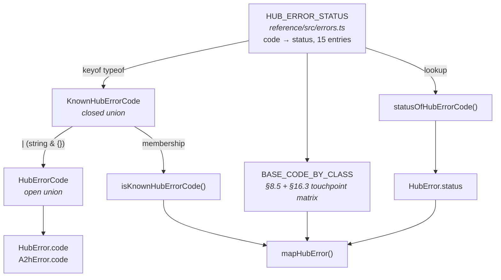
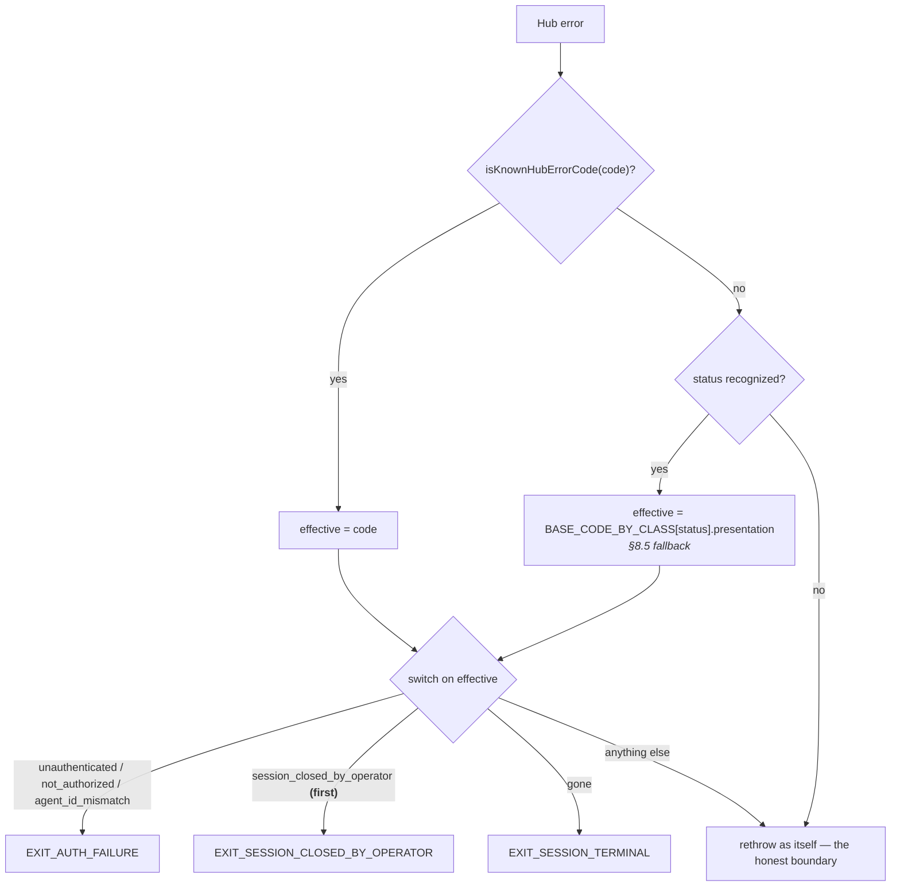

# feat: Type the Hub error-code vocabulary and model the §8.5 status class

**Target repo:** `ma2h-protocol` · **Branch:** `43-hub-error-code-union` · **Issue:** #43 (follow-up from #41 / PR #42)

---

## Summary

`HubError.code` and `A2hError.code` are bare `string`s, and `HubError` carries no HTTP status class. The first leaves the reference's error vocabulary undocumented at the type level; the second makes it structurally impossible for the reference to implement §8.5's unknown-code fallback MUST, a deviation the `runBridgeLoop` header comment currently confesses in prose.

This plan adds one dependency-free module, `reference/src/errors.ts`, holding a **single** code→status table. The `KnownHubErrorCode` union is *derived from* that table (`keyof typeof`), never declared alongside it — the same one-definition discipline #41 applied to `MA2H_VERSION` and the shared MAC rule. `HubError` gains a derived `status`, and `mapHubError` is rewritten to resolve an effective code through the §8.5 fallback before its existing exit-code switch runs, turning the documented deviation into a literal implementation of the MUST.

Every change is additive. No exported identifier is renamed, no constructor call site is edited, and no existing `e.code === "literal"` comparison in the test suite changes — the vendored surface `packages/ma2h-core` consumes byte-for-byte stays import-compatible.

---

## Problem Frame

Two gaps, one root cause: the reference has an error-code *vocabulary* but no place that says so.

**Gap 1 — the vocabulary is untyped.** Thirteen distinct codes are emitted across ~50 `new HubError(...)` sites in `reference/src/hub.ts`, and consumed as untyped literals in `mapHubError` (`reference/src/agent.ts`) and ~40 test assertions. Nothing connects emitter to consumer. This is the drift class #41 fixed for the wire version — where five re-declaration sites drifted to advertising `v0.3` while emitting `0.5` — not yet applied to error codes.

**Gap 2 — no status class, so §8.5 cannot be implemented.** §8.5 says an HTTP client MUST treat an unrecognized `code` as the code its touchpoint would return absent the refinement. The reference cannot do this: with no status on `HubError` there is no class to fall back *within*. `runBridgeLoop`'s header comment (`reference/src/agent.ts:633-636`) documents the deviation honestly, but the oracle does not match the spec MUST — and the reference is what implementers read to learn what conformance looks like.

The two gaps share a fix: a status table is simultaneously the one definition the union derives from and the class the fallback needs.

---

## Requirements

| ID | Requirement | Source |
|----|-------------|--------|
| R1 | An exported open-ended union types `HubError.code` and `A2hError.code`, so the vocabulary is discoverable and downstream Hubs can still emit their own codes. | Issue #43 §1 |
| R2 | The union derives from a single code→status table. No second declaration of the code set exists anywhere. | Issue #43 §1; #41 precedent |
| R3 | `HubError` exposes the HTTP status class of its code, derived by default and overridable for downstream codes. | Issue #43 §2 |
| R4 | `mapHubError` implements §8.5's unknown-code fallback literally for the presentation touchpoint: an unrecognized 410 reads as `gone` → `EXIT_SESSION_TERMINAL`. | Issue #43 §2; spec §8.5, §16.3 |
| R5 | A *recognized* code the bridge does not map (e.g. `not_found`, `rate_limited`) still rethrows loudly. The fallback applies only to unrecognized codes. | spec §8.5 ("unrecognized `code`") |
| R6 | `session_closed_by_operator` is still matched before the generic 410 terminal class. | `reference/src/agent.ts:729-736`; spec §16.4 |
| R7 | Every change is additive: no renamed export, no edited constructor call site, no churned test assertion. | Issue #43 ("Both additive to the vendored surface") |
| R8 | The `runBridgeLoop` header comment no longer claims a deviation the code no longer has. | Issue #43 §2 |

---

## High-Level Technical Design

### The one definition, and what derives from it

Nothing in this graph re-declares the code set. Adding a code means adding one table row; the union, the guard, and the status lookup all follow.

### The §8.5 base-code matrix

§8.5 says an unrecognized code reads as the base code its **touchpoint** would return. Where a class has one base code, the touchpoint is irrelevant; where it has more, §16.3's table splits it. This is the matrix the module encodes:

| Status | Presentation touchpoint (drain / ack / resolve `?session=` / stream) | Own-session submit (`agent.session`) | Addressed send (`to`) |
|--------|------------------------------|--------------------|--------------------|
| 400 | `validation_error` | `validation_error` | `validation_error` |
| 401 | `unauthenticated` | `unauthenticated` | `unauthenticated` |
| 403 | `not_authorized` | `not_authorized` | `not_authorized` |
| 404 | `not_found` | `not_found` | `not_found` |
| 409 | `already_terminal` | `already_terminal` | `already_terminal` |
| **410** | **`gone`** | **`destination_gone`** | **`destination_gone`** |
| 422 | `invalid_field` | `invalid_field` | `unknown_destination` |
| 429 | `rate_limited` | `rate_limited` | `rate_limited` |

Only the 410 and 422 rows actually vary — those are exactly the two classes §8.5 calls out as multi-base ("an unrecognized `410` … reads as `gone` … at a destination-addressing touchpoint as `destination_gone` … and an unrecognized `422` as `invalid_field`"). The uniform rows are still written out rather than defaulted, so the table reads as the spec table it mirrors.

### `mapHubError` after the change

The switch body and its deliberate ordering (R6) are unchanged; only its *input* changes, from a raw string to a §8.5-resolved effective code. That is what makes the fallback a two-line addition rather than a rewrite — and it is why an unrecognized 410 lands on `EXIT_SESSION_TERMINAL` without a second code path that could drift from the first.

---

## Key Technical Decisions

### KTD1. The open union gives autocomplete and intent, not typo rejection — say so, and put the enforcement elsewhere

The issue asks for both an open-ended union (`KnownHubErrorCode | (string & {})`, so downstream Hubs can extend) and compile-time protection against typos. **These are in direct conflict.** `(string & {})` accepts `"gonee"` exactly as happily as `string` does; the idiom preserves editor autocomplete on a union that also admits arbitrary strings, and that is all it does. A plan that claims the open union rejects typos at compile time would be selling something TypeScript cannot deliver.

Openness wins, because `packages/ma2h-core` vendors this surface byte-for-byte and oh-hai's Hub emits codes the reference does not know — a closed constructor parameter would break the consumer this issue exists to serve. The typo protection is therefore relocated to two places that actually bite:

1. **A source-scan test** (U4) asserting every `new HubError("<literal>")` in `reference/src/**` names a known code. This repo already CI-guards source text this way (`scripts/check-frozen-identifiers.sh`), so it is house-idiomatic rather than novel.
2. **Loud runtime degradation.** A typo'd code has no status, so `mapHubError` falls through to the rethrow — the bridge fails loudly instead of silently mapping to a wrong exit. Gap 2's fix makes Gap 1's residual failure mode safe.

### KTD2. A new dependency-free module, not an addition to `types.ts` or `hub.ts`

`reference/src/errors.ts` mirrors `reference/src/version.ts` exactly: a standalone module with no imports, so downstream can vendor it byte-for-byte and import the one definition. It cannot live in `types.ts` (which `hub.ts` imports) or `hub.ts` (which `types.ts` must not import) without creating a cycle the moment `A2hError.code` is typed.

`HubError` itself **stays in `hub.ts`**. Moving the class would change its import path and break the byte-for-byte re-vendor — the opposite of R7.

### KTD3. `status` is derived by default, overridable by a fourth optional constructor parameter

Hand-passing a status at ~50 throw sites would reintroduce precisely the drift this issue is about, and would violate R7's no-edited-call-sites constraint. So the default is a table lookup on `code`. The optional fourth parameter exists for the case the table cannot serve: a downstream Hub raising its own code with a known class. Positional (`code, message, details?, status?`) rather than an options bag, because an options bag would break the three existing `details`-passing sites.

Under `noUncheckedIndexedAccess` the lookup is naturally `HubErrorStatus | undefined`, which is the honest type for an unknown code. The field is declared `readonly status: HubErrorStatus | undefined` rather than `status?:` — `exactOptionalPropertyTypes` is on, and an always-present-but-possibly-undefined field is what this actually is.

### KTD4. The fallback is gated on *unrecognized*, not on *unmapped*

R5 is the subtle one. `not_found` is a recognized code that `mapHubError` deliberately does not map — it rethrows because a 404 is not one of the four fatal bridge classes. If the fallback were gated on "unmapped" rather than "unrecognized", `not_found` (404) and `rate_limited` (429) would start resolving through the base-code table and could pick up exit semantics they must not have. `isKnownHubErrorCode` is the gate, and U3's test scenarios pin this explicitly.

### KTD5. `A2hError` gets the code union and nothing else

§8.5's wire envelope is exactly `{ "error": { "code", "message" } }`. Status is HTTP-level, carried by the response, not the body. Adding a status field to `A2hError` would invent wire surface the spec does not define. `A2hError.code: HubErrorCode` is the whole change.

### KTD6. `not_acknowledgeable` is classed 409, on spec evidence

The code is emitted twice by `reference/src/hub.ts:1314,1323` but is absent from §8.5's status table. §14.3 supplies the class directly: *"Requires the message to be terminal (a resolution exists) — acking an `open` message is `409`."* That matches `already_terminal`'s "state does not permit this action" reading. Classed 409; the spec-table omission is recorded as a follow-up (this issue is scoped `reference:`, not `spec:`).

---

## Implementation Units

### U1. Add `reference/src/errors.ts` — the one definition

**Goal:** One dependency-free module holding the code→status table, the derived unions, the membership guard, and the §8.5 base-code matrix.

**Requirements:** R1, R2, R6 (matrix), and the substrate for R3–R5.

**Dependencies:** none.

**Files:**
- create `reference/src/errors.ts`
- create `reference/test/errors.test.ts`

**Approach:**

`HUB_ERROR_STATUS` is a `const` object mapping code → status, written `as const satisfies Record<string, HubErrorStatus>` — the `satisfies` idiom already established at `reference/src/signing.ts:39,221,335,413,475`. Fifteen entries: the fourteen codes in §8.5's table plus `not_acknowledgeable` (KTD6). Include `agent_id_mismatch` and `idempotency_conflict` even though `hub.ts` does not currently emit them — they are spec vocabulary, `mapHubError` already matches `agent_id_mismatch`, and the table documents the protocol's vocabulary, not merely this Hub's emissions.

Derive rather than declare:
- `KnownHubErrorCode = keyof typeof HUB_ERROR_STATUS`
- `HubErrorCode = KnownHubErrorCode | (string & {})` — carry a comment stating plainly what the idiom does and does not buy (KTD1), so a future reader does not mistake it for enforcement
- `HubErrorStatus` — the closed numeric union of statuses §8.5 defines
- `isKnownHubErrorCode(code: string | undefined): code is KnownHubErrorCode` — an `Object.hasOwn` / `in` check against the table
- `statusOfHubErrorCode(code: string | undefined): HubErrorStatus | undefined`

`HubTouchpoint = "presentation" | "own-session-submit" | "addressed-send"` names §16.3's three rows. `BASE_CODE_BY_CLASS` encodes the HTD matrix as `Record<HubErrorStatus, Record<HubTouchpoint, KnownHubErrorCode>>`, and `baseCodeForStatus(status, touchpoint)` reads it. Typing the record with an explicit `Record<HubErrorStatus, …>` annotation (not `satisfies` alone) makes a missing status class a compile error — that is the exhaustiveness that genuinely bites here.

Module header comment follows `version.ts`'s shape: what the module is, why it is standalone, which spec sections it encodes, and which drift incident motivated it.

**Patterns to follow:** `reference/src/version.ts` (standalone vendorable module, explanatory header); `reference/src/signing.ts:28-39` (`as const satisfies` table).

**Test scenarios** (`reference/test/errors.test.ts`):
- Every code in §8.5's table appears in `HUB_ERROR_STATUS` with the status the spec table assigns it — assert all fourteen pairs explicitly, so a wrong status is caught rather than merely a missing key.
- `not_acknowledgeable` maps to 409.
- `isKnownHubErrorCode` returns true for each table key; false for `"gonee"`, `""`, and `undefined`.
- `statusOfHubErrorCode("gone")` is 410; `statusOfHubErrorCode("downstream_custom_code")` is `undefined`.
- `baseCodeForStatus(410, "presentation")` is `"gone"`; `baseCodeForStatus(410, "own-session-submit")` and `(410, "addressed-send")` are both `"destination_gone"` — the §16.3 split, pinned.
- `baseCodeForStatus(422, "addressed-send")` is `"unknown_destination"`; `(422, "presentation")` is `"invalid_field"`.
- Every base code returned by `baseCodeForStatus`, across all statuses × all touchpoints, is itself a key of `HUB_ERROR_STATUS` **and** classes back to the same status — this catches a matrix row that names a code from the wrong class.

**Verification:** `npm run typecheck` clean; the new test file passes; no other source file imports it yet.

---

### U2. Type `HubError` and `A2hError`, and derive `HubError.status`

**Goal:** Both `.code` fields carry the union; `HubError` exposes its status class.

**Requirements:** R1, R3, R7.

**Dependencies:** U1.

**Files:**
- modify `reference/src/hub.ts` (the `HubError` class, ~lines 76-91, and its import block)
- modify `reference/src/types.ts` (`A2hError`, ~lines 587-589, and a new import)

**Approach:**

`HubError`'s `code` parameter property becomes `HubErrorCode`; a fourth optional `status?: HubErrorStatus` parameter is appended; a `readonly status: HubErrorStatus | undefined` field is assigned `status ?? statusOfHubErrorCode(code)` in the constructor body (KTD3). Extend the existing `details` doc comment with a sibling comment for `status` explaining that it is the §8.5 class, derived from the code, and that `undefined` means "a code outside this implementation's vocabulary".

`A2hError.code` becomes `HubErrorCode` (KTD5 — no status field). `types.ts` currently imports nothing; adding `import type { HubErrorCode } from "./errors.js";` gives it its first import, which is fine — `errors.ts` imports nothing, so no cycle is possible. Use `import type` (the repo sets `verbatimModuleSyntax`).

Optionally re-export the code types from `hub.ts` so `import { HubError, type HubErrorCode } from "./hub.js"` works for existing consumers without a second import line.

Because the union is open, all ~50 existing `new HubError("literal", …)` sites and all ~40 `e.code === "literal"` test comparisons compile unchanged. That is the R7 check, and it should be verified rather than assumed.

**Patterns to follow:** the existing `details` parameter-property + doc-comment shape in `HubError`.

**Test scenarios** (extend `reference/test/errors.test.ts`):
- `new HubError("gone", "msg").status` is 410; `new HubError("invalid_field", "msg").status` is 422.
- `new HubError("downstream_custom_code", "msg").status` is `undefined` — the open union admits the code, the table declines to class it.
- An explicit override wins: `new HubError("downstream_custom_code", "msg", undefined, 410).status` is 410.
- The existing `details` argument still round-trips when a status is also passed — the two optional positional parameters do not interfere.
- A `HubError` for every key of `HUB_ERROR_STATUS` reports the table's status, iterating the table rather than restating it.

**Verification:** `npm run typecheck` and `npm test` both clean with zero edits to any existing `new HubError` call site or test assertion — confirm by inspecting the diff, not just the exit code.

---

### U3. Implement the §8.5 unknown-code fallback in `mapHubError`

**Goal:** The oracle matches the spec MUST at the presentation touchpoint, and stops confessing a deviation it no longer has.

**Requirements:** R4, R5, R6, R8.

**Dependencies:** U1, U2.

**Files:**
- modify `reference/src/agent.ts` (`mapHubError` ~lines 724-741; the `runBridgeLoop` header comment ~lines 633-636; the resolve-site guard at ~line 809)
- modify `reference/test/bridge.test.ts`

**Approach:**

Introduce a small local helper that reads `code` and `status` off the thrown value and returns the **effective** code: the code itself when `isKnownHubErrorCode`, otherwise `baseCodeForStatus(status, "presentation")`, otherwise `undefined`. All four `runBridgeLoop` call sites — `registerSession`, `drainInbox`, `ackInbox`, `closeSession` — are presentation touchpoints per §16.3's third row, so one touchpoint constant covers them.

`mapHubError` then switches on the effective code. **The switch body and its ordering are untouched** (R6: `session_closed_by_operator` before the generic 410). An effective code of `undefined` — unrecognized code with no status, or a status outside §8.5's classes — rethrows as itself, preserving the honest loud boundary.

The resolve-site guard at line 809 currently reads `if ((e as { code?: string }).code !== "already_terminal")`. §8.5 applies here too: resolve-with-`?session=` is a presentation touchpoint, and an unrecognized 409 must read as `already_terminal` (losing the §7 CAS race is a normal outcome). Route this guard through the same effective-code helper so the fallback is expressed once rather than twice.

Rewrite the `runBridgeLoop` header's "second boundary" paragraph: it now states that the loop *implements* §8.5's fallback for the presentation touchpoint, that an unrecognized 410 reads as `gone`, and that a code with no recognizable class still surfaces loudly. Keep the first boundary (the unread final close) — that one is still real.

**Patterns to follow:** the existing `mapHubError` comment style, which cites the spec section beside each branch.

**Test scenarios** (`reference/test/bridge.test.ts`, driving the existing failure-transport stub pattern):
- Unrecognized code with status 410 thrown from `drainInbox` → `BridgeExitError` with `EXIT_SESSION_TERMINAL`. The headline R4 case.
- The same unrecognized 410 thrown from each of `registerSession`, `ackInbox`, and `closeSession` → `EXIT_SESSION_TERMINAL` at every presentation touchpoint, not just the one.
- Unrecognized code with status 401, and separately 403 → `EXIT_AUTH_FAILURE`.
- **Recognized-but-unmapped still rethrows (R5, KTD4):** `not_found` (404) and `rate_limited` (429) propagate as the original `HubError`, not as a `BridgeExitError`.
- Unrecognized code with **no** status → rethrows as itself. The honest boundary survives.
- Unrecognized code with a status outside §8.5's classes (e.g. 500) → rethrows as itself.
- **R6 ordering holds through the fallback:** a *known* `session_closed_by_operator` (410) still exits `EXIT_SESSION_CLOSED_BY_OPERATOR`, never `EXIT_SESSION_TERMINAL` — the known-code path must not be diverted through the base-code table.
- Resolve-site: an unrecognized 409 from `resolveAsAgent` is swallowed as a lost CAS race (the loop continues and the report still counts the message), while an unrecognized 410 from the same call exits `EXIT_SESSION_TERMINAL`.
- Regression: every existing bridge-loop exit-code test still passes unchanged.

**Verification:** `npm test` clean; the header comment contains no claim the code contradicts.

---

### U4. Guard the emitter vocabulary against drift

**Goal:** A typo'd or newly-invented code in `reference/src/**` fails the build instead of silently degrading.

**Requirements:** R2 (drift protection), KTD1.

**Dependencies:** U1.

**Files:**
- modify `reference/test/errors.test.ts`

**Approach:**

Scan `reference/src/*.ts` for `new HubError("<literal>"` occurrences, collect the literals, and assert each is a `KnownHubErrorCode`. Read the sources with `node:fs` relative to the test file's own URL rather than the process cwd, so the test passes under both `npm test` and a direct `node --import tsx --test` invocation.

Two hardening details, both load-bearing:
- **Fail closed on a broken scan.** Assert the scan found at least as many sites as exist today (a floor constant, with a comment saying to raise it, never lower it). Without this, a regex that silently stops matching turns the guard into a no-op that still reports green.
- **Cover the indirect emitter.** `session_closed_by_operator` is emitted through `Hub.operatorClosedError` (`reference/src/hub.ts:428-433`), not a bare `new HubError("session_closed_by_operator"` at the throw site — the regex *does* catch it at the helper's own construction, but assert its presence explicitly so a future refactor to a computed code cannot quietly drop it from coverage.

**Test scenarios:**
- Every code literal found in `reference/src/**` is a key of `HUB_ERROR_STATUS`; the failure message names the offending literal and its file so the fix is obvious.
- The scan finds at least the floor count of sites.
- `session_closed_by_operator` is among the scanned literals.

**Verification:** the guard passes today; hand-introducing a typo'd code in a scratch edit makes it fail with a message that names the typo (verify once, then revert).

---

### U5. Record the change in the changelog

**Goal:** The vendored-surface addition is documented where downstream re-vendors look.

**Requirements:** R7 (coordination with oh-hai#712).

**Dependencies:** U1–U4.

**Files:** modify `CHANGELOG.md`

**Approach:** Add a bullet under `## Unreleased`. The #41 entry established the shape: what was added, which spec section it encodes, which downstream drift it prevents, and an explicit statement of what did *not* change. State that no exported identifier was renamed and no call site edited, so the re-vendor is a clean additive pull; note that `errors.ts` is new and must be added to the vendored file list.

Match the existing entry's density — the surrounding bullets are dense and specific, and a thin one would read as an afterthought.

**Test expectation:** none — documentation.

**Verification:** the entry names `errors.ts`, `HubErrorCode`, `HubError.status`, and §8.5; `npm test` and the CI guard scripts still pass (the changelog is not scanned by `check-frozen-identifiers.sh`, but confirm rather than assume).

---

## Scope Boundaries

**In scope:** `reference/src/errors.ts`, `reference/src/hub.ts` (`HubError` only), `reference/src/types.ts` (`A2hError` only), `reference/src/agent.ts` (`mapHubError`, the resolve-site guard, the `runBridgeLoop` header comment), `reference/test/errors.test.ts`, `reference/test/bridge.test.ts`, `CHANGELOG.md`.

**Not in scope:**
- **Editing existing throw sites or test assertions.** The open union exists precisely so they compile untouched (R7). If a site needs editing, that is a signal the design is wrong, not a task to absorb.
- **Emitting status over any transport.** The reference Hub is in-memory; there is no HTTP layer to attach a status to. `HubError.status` is a *model* of the class, for the fallback's benefit.
- **`agent_id_mismatch` / `idempotency_conflict` emission.** They enter the table as vocabulary; making `hub.ts` actually raise them is separate protocol work.

**Deferred to follow-up work:**
- **§8.5's status table omits `not_acknowledgeable`.** The reference emits it and §14.3 classes it 409, but the §8.5 table does not list it. A `spec:` change, out of scope for a `reference:`-scoped issue — file after merge.
- **The oh-hai re-vendor** (autnmy/oh-hai#712) picks up `errors.ts` and the widened types. Tracked in that repo.

---

## Risks

| Risk | Mitigation |
|------|-----------|
| The open union silently accepts a typo — the very failure the issue names. | Acknowledged head-on in KTD1 rather than papered over. U4's source scan is the actual guard; U3's rethrow-on-unclassed-code makes the residual case loud. |
| The fallback swallows an error that should have stayed loud. | KTD4 gates on *unrecognized*, and U3 pins `not_found` / `rate_limited` / no-status / unknown-status as explicit rethrow scenarios. |
| The §16.3 matrix is transcribed with a wrong base code. | U1's cross-check scenario asserts every matrix entry classes back to the status it is filed under, so a code borrowed from the wrong class fails. |
| `types.ts` gaining its first import breaks the byte-for-byte re-vendor. | `errors.ts` imports nothing, so the vendor set grows by exactly one self-contained file. Called out in U5's changelog entry so the downstream pull is not surprised. |
| The U4 scan regex rots into a green no-op. | The floor-count assertion fails the build if the scan stops finding sites. |

---

## Open Questions

None blocking. One judgment call worth a reviewer's eye: **U1 includes `agent_id_mismatch` and `idempotency_conflict` in the table though `hub.ts` never emits them.** The reasoning is that the table documents §8.5's vocabulary (and `mapHubError` already matches `agent_id_mismatch`), not this Hub's current emissions. A reviewer preferring emissions-only would drop those two rows; the fallback behavior is unaffected either way, since both classes have a base code regardless.

---

## Sources & Research

- Issue [#43](https://github.com/autnmy/ma2h-protocol/issues/43); predecessor #41 / PR #42.
- `spec/v0.5.md` §8.5 (error model, status table, unknown-code fallback MUST), §14.3 (ack `409`, sourcing KTD6), §16.3 (terminal-session touchpoint table), §16.4 (operator kill-switch marker).
- `reference/src/version.ts` — the standalone-vendorable-module precedent from #41 (KTD2).
- `reference/src/signing.ts:28-39` — the `as const satisfies` table idiom (U1).
- `scripts/check-frozen-identifiers.sh` — the source-scanning CI guard precedent (U4).
- `reference/tsconfig.json` — `exactOptionalPropertyTypes`, `noUncheckedIndexedAccess`, `verbatimModuleSyntax`, and `include: ["test/**/*.ts"]` all shape U1–U2's type choices.
- `CHANGELOG.md` `## Unreleased` — the #41 entry sets U5's shape.
