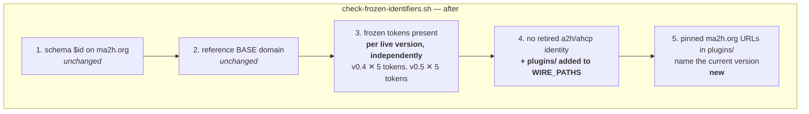
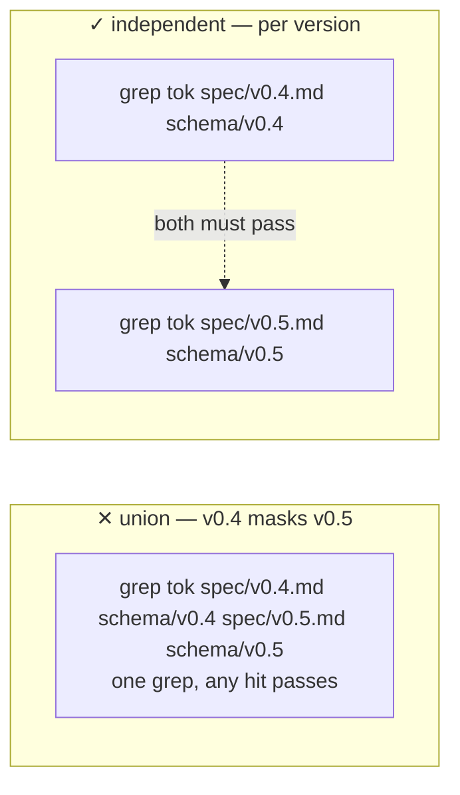
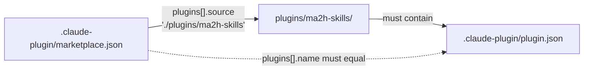

# fix: close the CI guard blind spots — live-version pins, plugins/ scan, plugin manifest gating

## Summary

Implements #44 and #36 in one pass over the CI guard surface, because both change the same script and landing them separately would touch it twice. Three parts, in order: (1) the frozen-wire-token assertion stops validating a single hardcoded version and instead checks **every live version independently**, closing the v0.5 blind spot that let PR #42 pass vacuously; (2) the retired-identity scan extends to `plugins/`, which is the literal text implementers copy into downstream apps; (3) a new dependency-free Ruby gate parses the plugin manifests and proves every marketplace entry resolves to a real plugin, so a hand-edit that breaks `/plugin install` fails in CI instead of at a user's terminal.

---

## Problem Frame

`scripts/check-frozen-identifiers.sh` is the repo's drift guard, and two of its four assertions are aimed at surfaces that no longer match reality.

**The version pin is stale.** `CURRENT_SPEC="spec/v0.4.md"` and `CURRENT_SCHEMA_DIR="schema/v0.4"` were correct when v0.4 was the only live contract. v0.5 has since merged, and the frozen-token assertion has never once inspected `spec/v0.5.md` or `schema/v0.5/`. Every schema and spec edit in PR #42 satisfied a guard that was looking somewhere else. A guard that cannot fail is indistinguishable from no guard, and this one has been reporting success for a surface it does not read.

**The scan misses the copy-paste surface.** `WIRE_PATHS` covers `schema/`, `reference/src/`, `examples/`, and `conformance/vectors/` — everywhere the wire identifiers are *defined*, and nowhere they are *distributed*. The six skills under `plugins/ma2h-skills/skills/` contain wire identifiers verbatim; they exist to be copied into implementers' codebases. A retired identifier reintroduced there passes CI and is then propagated by design into every downstream app that runs the skill.

**The manifests are unparsed.** `.claude-plugin/marketplace.json` and `plugins/ma2h-skills/.claude-plugin/plugin.json` are hand-edited on most plugin changes and no CI job reads them. A trailing comma, or a `plugins[].source` pointing at a moved directory, ships green and surfaces as a broken `/plugin install` for a user. `scripts/check-skill-frontmatter.rb` already gates the *skills*; the *manifests* that ship them have no equivalent.

**Scoping correction carried into this plan.** #44 asks to "bump the pins to the v0.5 surfaces." Taken literally that is a replacement, and it would regress coverage: `spec/v0.5.md` states v0.5 is "additive and backward-compatible … alongside the unchanged v0.4 legs," and `reference/src/conformance.ts` still routes every non-`v0.5/` vector to the v0.4 snapshot validators. v0.4 is a live surface with live consumers. Replacing the pin would move the blind spot rather than close it, so this plan covers **both** live versions. Confirmed with the requester before planning.

---

## Requirements

**Live-version frozen-token coverage (#44)**

- R1. The frozen-token assertion checks every live normative version — currently `v0.4` and `v0.5` — not one hardcoded pin.
- R2. Each version is checked **independently**. A token present in v0.4 must not satisfy the assertion for v0.5. This is the masking bug the script's own scoping comment exists to prevent, and a naive union across both surfaces would reintroduce it one level up.
- R3. Per-version granularity stays `spec/<ver>.md` + `schema/<ver>/` as a union, matching current semantics. This is load-bearing: `MA2H-Signature` and `MA2H_CALLBACK_SECRET` appear in the spec only, in both v0.4 and v0.5, so a spec-and-schema-must-both-contain rule would fail immediately on a correct tree.
- R4. A version named in the live list but missing from disk fails loudly with a message naming the missing path, rather than being reported as a missing token.
- R5. The frozen-token list itself is unchanged — all five tokens are already present in v0.5, so no token-list refresh is needed.

**Retired-identity scan over `plugins/` (#36 part 2)**

- R6. `plugins/` is scanned for the retired `a2h` / `ahcp` identities alongside the existing wire paths.
- R7. The `-w` / `-F` grep semantics are preserved unchanged. `-w` is load-bearing because the live identity `ma2h` literally contains `a2h`; without it every legitimate `ma2h_version` in the skills would be flagged.

**Skills version-drift guard (#36, the "consider" item)**

- R8. Pinned `ma2h.org/spec/` and `ma2h.org/schema/` URLs under `plugins/` must name the current version.
- R9. Matching is **URL-shaped only**. Bare prose version mentions stay legal — "the v0.4 inbound leg" appears throughout the skills and in `plugin.json`'s own description, and a bare-string match would fail on a correct tree immediately.
- R10. Failures report file, line, and the offending URL.

**Plugin manifest gating (#36 part 1)**

- R11. Every `.claude-plugin/*.json` in the repo is JSON-parsed; a syntax error fails CI with the file and parser message.
- R12. For each `marketplace.json`, every `plugins[]` entry resolves: the `source` directory exists and contains a parseable `.claude-plugin/plugin.json`.
- R13. The marketplace entry `name` matches the resolved `plugin.json` `name` — a mismatch is an install-time failure.
- R14. Non-path sources (git/GitHub object or URL forms the plugin spec allows) are skipped for path resolution rather than failing, so the gate does not false-fail if a remote source is added later.
- R15. The checker is dependency-free Ruby stdlib, emits `::error::` annotations, and runs before `actions/setup-node` — matching `scripts/check-skill-frontmatter.rb` exactly.

---

## Key Technical Decisions

**KTD1 — Cover both live versions, checked independently, rather than bumping the pin.**
Rationale in the Problem Frame. The implementation shape is a `LIVE_VERSIONS` array with a nested loop: outer over versions, inner over tokens. The nesting order is the correctness property — one `grep` per (version, token) pair means v0.4 cannot vouch for v0.5. Adding v0.6 later is a one-element edit, which is the maintenance path that let this rot in the first place.

**KTD2 — Do not auto-derive the live-version list from the filesystem.**
Globbing `schema/v*/` would pick up v0.1–v0.3, which the existing scoping comment deliberately excludes: historical specs are frozen artifacts and asserting frozen tokens against them is meaningless. An explicit list is the honest encoding of "which contracts are live," a judgment the filesystem does not record. The cost is remembering to extend it, which R4's existence check partially covers by making a stale entry fail loudly rather than silently.

**KTD3 — Version-drift guard lives in the bash script, not the Ruby one.**
It is an identifier-drift assertion over documentation text, which is what `check-frozen-identifiers.sh` is for. The Ruby script's remit is manifest structure. Keeping them separate means each script has one reason to change.

**KTD4 — Ruby stdlib for the manifest gate.**
`check-skill-frontmatter.rb` is the direct precedent: stdlib only, `::error::` annotations, runs in the `tests` job before Node is set up. Ruby is preinstalled on `ubuntu-latest`, so this adds no setup step and no lockfile. `claude plugin validate` was considered and rejected — it would make CI depend on the CLI being installed and version-stable, and it does not cover the name-consistency check in R13.

**KTD5 — Guard changes are verified by deliberate mutation, not by a test framework.**
The repo has no shell/Ruby test harness, and adding one is out of scope. The failure mode being fixed *is* a guard that passes when it should fail, so "the script exits 0 on a clean tree" proves nothing on its own. Every unit is verified in both directions: green on the real tree, and red against a deliberately broken tree that is then reverted.

---

## High-Level Technical Design

The frozen-identifier guard's assertion set, before and after. Assertions 1 and 2 are untouched.

The masking property R2 turns on, expressed as the loop nesting. The left shape is what a naive read of #44's "bump the pins" produces; the right is what this plan builds.

Manifest resolution chain the Ruby gate walks (R12/R13):

*Directional — the prose requirements above are authoritative where they differ.*

---

## Implementation Units

### U1. Check frozen tokens against every live version, independently

**Goal:** Close the #44 blind spot without regressing v0.4 coverage.

**Requirements:** R1, R2, R3, R4, R5

**Dependencies:** none

**Files:**
- `scripts/check-frozen-identifiers.sh` (modify)

**Approach:** Replace the `CURRENT_SPEC` / `CURRENT_SCHEMA_DIR` scalars with a `LIVE_VERSIONS=("v0.4" "v0.5")` array. Derive `spec/<ver>.md` and `schema/<ver>` inside the loop rather than storing paired paths, so the two can never drift apart. Assert both paths exist before the token loop (R4) — without it, a typo'd version still fails, but reports five missing tokens instead of one missing directory. Keep `FROZEN_WIRE_TOKENS` and the `grep -rq` union-per-version exactly as-is (R3, R5). Error messages must name the version whose surface failed, since "token missing" without a version is not actionable when the list has more than one entry.

Rewrite the header comment's item 3 and the `CURRENT_*` scoping rationale. The existing comment explains why scoping to one version beats grepping all of `spec/`; the replacement must explain the same anti-masking reason *and* why the list has two entries — that v0.5 is additive and v0.4 still backs the conformance validators. A future reader who sees two versions and assumes one is vestigial will "clean up" this fix.

**Patterns to follow:** the existing `for tok in "${FROZEN_WIRE_TOKENS[@]}"` loop and the `err` helper; keep `set -uo pipefail` fail-open-then-tally behavior so every problem is reported in one run rather than stopping at the first.

**Test scenarios:**
- Clean tree → passes, exit 0.
- Temporarily rename a frozen token in `spec/v0.5.md` (e.g. `ma2h_version` → `ma2h_ver`) → fails, message names v0.5. **This is the regression test for #44** — on the current script this mutation passes green. Revert.
- Same mutation in `spec/v0.4.md` → fails, message names v0.4. Confirms the bump did not drop v0.4. Revert.
- Rename the token in v0.4 **and** v0.5 simultaneously → fails naming both, confirming independence rather than short-circuit-on-first-hit.
- Add a bogus `v9.9` to `LIVE_VERSIONS` → fails naming the missing `spec/v9.9.md` path, not five missing tokens. Revert.
- Confirm a spec-only token (`MA2H-Signature`) still passes for both versions — guards against an accidental tightening to spec-AND-schema.

**Verification:** the script passes on the real tree, and each mutation above produces a failure whose message identifies the right version and path.

---

### U2. Extend the retired-identity scan to `plugins/`

**Goal:** Stop retired `a2h` / `ahcp` identifiers from shipping through the skills into downstream apps.

**Requirements:** R6, R7

**Dependencies:** U1 (same file; sequencing avoids a self-conflict)

**Files:**
- `scripts/check-frozen-identifiers.sh` (modify)

**Approach:** Append `"plugins/"` to `WIRE_PATHS`. The scan loop, the `-rIlwF` flags, and the reporting are unchanged — the `-w` rationale already documented in the comment covers the new path and is what makes this a clean one-element addition (verified: `plugins/` currently has zero forbidden-token hits, so this cannot land red). Extend the header comment's item 4 so the enumerated surface list names `plugins/`, and say *why* it is on the wire surface — the skills are distributed text, not internal docs. Without that sentence the entry reads as a stray inclusion.

**Patterns to follow:** the existing `FORBIDDEN_TOKENS` loop; no structural change.

**Test scenarios:**
- Clean tree → passes.
- Insert a standalone retired token (e.g. `A2H-Signature`) into one `plugins/ma2h-skills/skills/*/SKILL.md` → fails, output names the file. **This is the regression test for #36 part 2.** Revert.
- Confirm the legitimate `ma2h` identifiers already throughout `plugins/` do **not** trip the scan — this is the `-w` false-positive check, and it is the reason the addition is safe. Covered by the clean-tree run, which now scans ~7 files it previously skipped.
- Insert a retired token into `plugins/ma2h-skills/README.md` → also caught (the path is scanned recursively, not just `skills/`). Revert.

**Verification:** clean tree passes with `plugins/` in scope; a planted retired identifier in `plugins/` fails and is reported with its path.

---

### U3. Assert the skills' pinned ma2h.org URLs name the current version

**Goal:** Catch the next version bump that updates the spec but forgets the eight hand-pinned URLs in the skills.

**Requirements:** R8, R9, R10

**Dependencies:** U1 (reads the live-version list)

**Files:**
- `scripts/check-frozen-identifiers.sh` (modify)

**Approach:** Add a fifth assertion. Define the current version as the last element of `LIVE_VERSIONS` so it cannot drift from U1's list. Match URL-shaped references only — a regex anchored on `ma2h\.org/(spec|schema)/v[0-9]+\.[0-9]+` — and report any whose version is not current. R9 is the correctness constraint and the reason this check is worth having rather than dangerous: bare `v0.4` mentions are legitimate and common in the skills, so the regex must require the `ma2h.org/spec/` or `ma2h.org/schema/` prefix. Use `grep -rInoE` so hits carry file, line, and the matched URL (R10), and compare the extracted version by string equality rather than embedding it in a regex, to avoid the unescaped `.` in `v0.5` matching `v0x5`.

Nothing in `plugins/` is stale today, so this lands green and is purely forward-looking. Note that in the comment — a reader who finds a guard with no history of firing should be able to tell it was preventative by design rather than dead.

**Patterns to follow:** assertion 4's `hits=$(...)` / `if [ -n "$hits" ]` shape, including the `sed` prefix used to indent offending lines under the error.

**Test scenarios:**
- Clean tree → passes (all 8 spec URLs and 5 schema URLs are v0.5).
- Change one `https://ma2h.org/spec/v0.5.md` to `v0.4.md` in any SKILL.md → fails, reporting file, line, and URL. Revert.
- Change a `https://ma2h.org/schema/v0.5/message.schema.json` to `v0.4` → fails (confirms the `schema` arm of the alternation, not just `spec`). Revert.
- **False-positive guard:** confirm the existing bare prose "v0.4" mentions in `plugins/ma2h-skills/README.md`, `plugin.json`, and `skills/implement/SKILL.md` do **not** fail. This is the scenario that kills the check if the regex is written loosely, and it is already exercised by the clean-tree run.
- Add a hypothetical `https://ma2h.org/spec/v0.6.md` → fails as non-current, confirming the check is version-equality and not a v0.4-denylist.

**Verification:** clean tree passes; a downgraded URL fails with location; bare prose version mentions never fail.

---

### U4. Gate the plugin manifests with a dependency-free Ruby checker

**Goal:** A malformed or unresolvable manifest fails CI instead of a user's `/plugin install`.

**Requirements:** R11, R12, R13, R14, R15

**Dependencies:** none (independent of U1–U3; ordered last because it is the new-file unit)

**Files:**
- `scripts/check-plugin-manifests.rb` (create)
- `.github/workflows/ci.yml` (modify)

**Approach:** Glob `**/.claude-plugin/*.json` with `File::FNM_DOTMATCH` — the dotfile flag is mandatory here, since `.claude-plugin` is dot-prefixed and a plain glob silently matches nothing. That silent-zero-match case is the same failure mode this whole plan is about, so the script must `abort` when it finds no manifests at all rather than reporting success (mirroring the frontmatter checker's `no SKILL.md files found` guard). Exclude `node_modules` and `.git` by path segment, as the frontmatter checker does.

Parse every manifest (R11). For files named `marketplace.json`, walk `plugins[]`: resolve `source` against the repo root — `dirname(dirname(marketplace_path))`, since the manifest sits at `<root>/.claude-plugin/marketplace.json` and sources are root-relative — then assert the directory exists and holds a parseable `.claude-plugin/plugin.json` (R12), and that the names agree (R13). Skip path resolution when `source` is a Hash or contains `://` (R14), reporting nothing rather than failing. Assert `name` is present and non-empty on every `plugin.json`.

Collect all failures and report them together, then `abort` — do not exit on the first. A partial report costs a full CI round-trip per problem.

Wire into `.github/workflows/ci.yml` as a step in the existing `tests` job, adjacent to the two existing script steps and before `actions/setup-node` (R15). No new job: these are sub-second checks and a separate job would pay ~30s of runner startup to save nothing.

**Patterns to follow:** `scripts/check-skill-frontmatter.rb` end to end — `# frozen_string_literal: true`, the explanatory header comment stating what class of bug it catches, the `failed = []` accumulator, `::error::` annotations, the `puts "OK: N ..."` success line, and `abort("N problem(s)")`.

**Test scenarios:**
- Clean tree → passes, reports both manifests checked.
- Introduce a JSON syntax error (trailing comma) in `.claude-plugin/marketplace.json` → fails with file and parser message. Revert.
- Same in `plugins/ma2h-skills/.claude-plugin/plugin.json` → fails. Revert.
- Point `plugins[].source` at a non-existent directory (`./plugins/does-not-exist`) → fails naming the unresolved source. Revert.
- Point `source` at a directory that exists but has no `.claude-plugin/plugin.json` (e.g. `./scripts`) → fails. This is the check that would have caught a plugin directory move, and it must not be satisfied by mere directory existence. Revert.
- Change the marketplace entry `name` to `ma2h-skillz` while `plugin.json` says `ma2h-skills` → fails on mismatch (R13). Revert.
- Set `source` to a Hash or a `https://` URL → skipped, no failure (R14).
- Temporarily rename `.claude-plugin/` so the glob matches nothing → aborts with "no manifests found" rather than passing green. This is the FNM_DOTMATCH regression test; without the flag, a clean tree hits this path. Revert.
- Confirm the checker runs under the repo's Ruby without gems: `ruby scripts/check-plugin-manifests.rb` with no bundler context.

**Verification:** clean tree passes locally and in CI; each mutation above fails with an actionable message; the CI step appears in the `tests` job ahead of the Node setup and is green on the PR.

---

## Scope Boundaries

**In scope:** `scripts/check-frozen-identifiers.sh`, a new `scripts/check-plugin-manifests.rb`, and the one CI step that runs it.

**Explicitly not in scope:**
- Refactoring the guard script beyond the four changes above. It is a working script with load-bearing comments; this is coverage hardening, not a rewrite.
- Adding a shell or Ruby test harness. KTD5 covers verification by mutation instead.
- Changing `FROZEN_WIRE_TOKENS` or `FORBIDDEN_TOKENS`. Verified unnecessary — all five frozen tokens are already present in v0.5.
- Retiring the v0.4 surface or migrating conformance vectors to v0.5. That is a protocol decision, and this plan's correctness depends on *not* pre-empting it.

### Deferred to Follow-Up Work
- **Auto-deriving the live-version list** (KTD2). If a v0.6 lands and the list is forgotten, the guard silently under-covers again — the same class of bug as #44. A `spec/v0.5.md`-header-driven derivation, or a check that the newest `schema/v*/` is in `LIVE_VERSIONS`, would close it. Not now: it needs a machine-readable notion of "live," which the repo does not yet have.
- **Running `claude plugin validate` in CI** if the CLI becomes a reliable CI dependency. It would cover manifest fields this gate does not model.

---

## Risks & Dependencies

- **The live-version list rots.** Highest-likelihood risk, and it is the exact failure being fixed. Mitigated by R4's loud failure on a missing path, by the rewritten comment stating the maintenance obligation, and by the deferred auto-derivation above. Not fully eliminated.
- **U3's regex is too loose and fails on legitimate prose.** Would break CI on a correct tree — the worst outcome for a guard, since the fix pressure is to delete it. Mitigated by R9's URL-prefix anchor and by an explicit false-positive test scenario, and bounded by the fact that a clean-tree run exercises all 13 existing pinned URLs plus every bare mention.
- **`FNM_DOTMATCH` omitted in U4** would make the manifest gate match zero files and report success — a new vacuous guard, repeating #44's bug in the fix for it. Mitigated by the empty-glob `abort` and its dedicated test scenario.
- **No dependency on other in-flight work.** All three parts are self-contained; the only ordering constraint is U1 before U2 and U3, which share a file.

---

## Sources & Research

- #44 (frozen-identifier pin) and #36 (plugin manifest + scan gaps) — issue bodies carry the original framing; #36 explicitly flags the pin bump as worth doing in the same pass.
- `spec/v0.5.md` header — "additive and backward-compatible … alongside the unchanged v0.4 legs," the basis for KTD1.
- `reference/src/conformance.ts` (~L81–84) — routes non-`v0.5/` vectors to v0.4 validators, confirming v0.4 is live.
- `scripts/check-skill-frontmatter.rb` — the pattern U4 follows.
- Verified pre-implementation against the working tree: all 5 frozen tokens present in v0.5; zero forbidden tokens in `plugins/`; token distribution identical across v0.4/v0.5 with `MA2H-Signature` and `MA2H_CALLBACK_SECRET` spec-only; 13 pinned `ma2h.org` URLs in `plugins/`, all v0.5; bare `v0.4` prose mentions present in 3+ plugin files.

No external research — this is repo-internal CI hardening with a direct local precedent.
