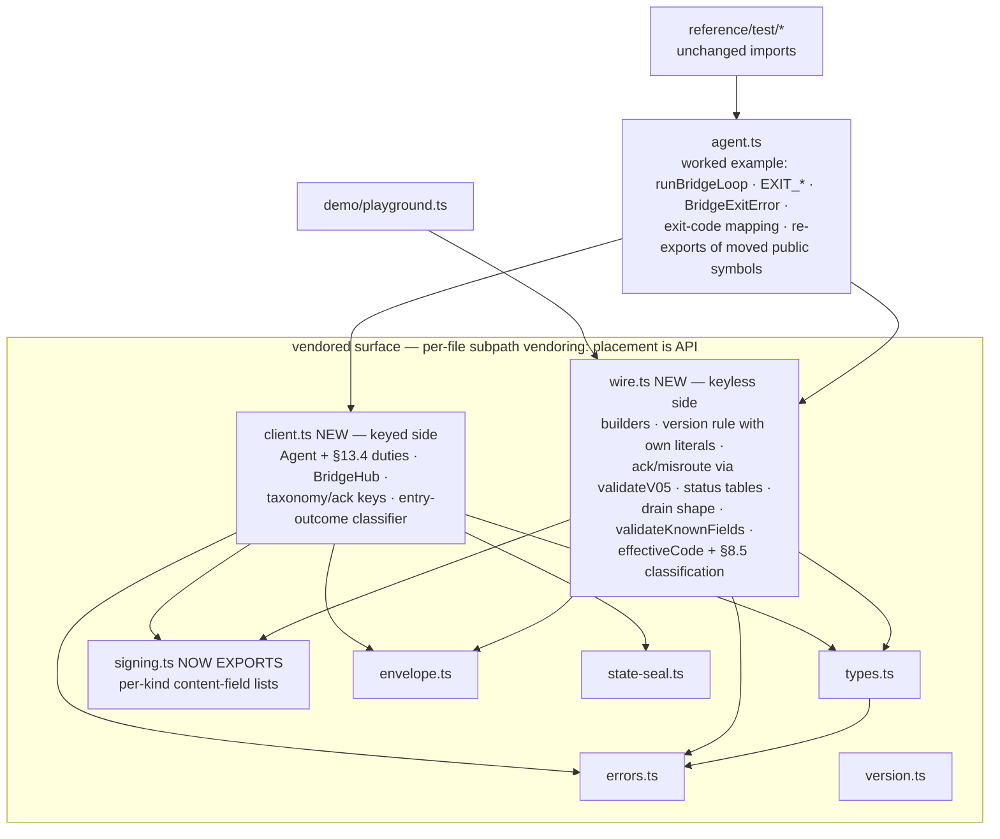

# refactor: extract the shared conformant-client layer from agent.ts

## Summary

Implements issue #45 (the upstream half of oh-hai#719). The client mechanics every implementer re-writes — the §13.4 duty machinery, entry taxonomy, ack keys, address grammar, §8.5 error reading — move from `agent.ts` into a vendorable layer, and the mechanics no reference code embodies yet — envelope builders, the version-stamp rule, §8.1 ack/misroute validation, per-type status tables — are built as new surface shaped by the two real downstream consumers. `runBridgeLoop` becomes the layer's first consumer with its observable behavior frozen: same exit codes, same reasons, all existing tests pass with zero test-file edits (237 at branch time — conformance vectors generate tests, so the invariant is the zero-edit rule, not the literal count).

---

## Problem Frame

oh-hai#711 and #712 were the same defect class: a protocol rule implemented twice drifted. The cross-repo research for this plan found **seven more live drifts** between oh-hai's CLI and MCP implementations of these mechanics — including a safety-relevant one (MCP discards `error.code`, so its session self-heal would re-register straight through the §16.4 operator kill-switch). The generator of the class is that the vendored reference exports primitives (signing, types, canonicalization) but not the client mechanics on top, so every consumer re-derives them. This layer is permanent vendored API once landed — downstream re-vendors per-file with subpath exports, so **symbol placement freezes with export names at merge**.

---

## Requirements

**Extraction (behavior frozen)**

- R1. The §13.4 duty machinery (`Agent` class, its result types, sanitizers, `parseSignatureHeader`, `splitAddress`, `ackKeyOf`) and the transport seam (`BridgeHub`) live in `client.ts`; `agent.ts` re-exports every previously-public moved symbol under its existing name, so all current imports keep resolving from `../src/agent.js`. Previously-private helpers become documented exports; every duty-order-sensitive export's doc comment states which prior duties it assumes already ran, and the module header names out-of-order composition by consumers as an accepted, explicitly-flagged risk (the `Agent` class remains the order-enforcing embodiment).
- R2. `runBridgeLoop`, `BridgeExitError`, the four `EXIT_*` constants, `BridgeReport`/`BridgeOptions`/`BridgeDecide`, and the exit-code half of `mapHubError` stay in `agent.ts` as the worked example — exit-code contracts are per-implementation (oh-hai#719's exclusion; the wire marker is the cross-implementation contract).
- R3. All existing tests pass with zero edits under `reference/test/` (237 at branch time). `instanceof BridgeExitError` still holds (single class definition), and the three reason-substring regexes in `bridge.test.ts` still match.
- R4. The entry-outcome classification the loop currently does by string prefix is promoted to layer-owned API keyed on **structured disposition codes minted at each refusal site** (an additive optional field on the result types — reason strings stay byte-identical as presentation). The classifier returns a discriminated union a TypeScript consumer must exhaustiveness-check (`never`-assertion documented as the consumption contract) so `fatal-verification` cannot silently merge into a default branch; fatal-before-benign precedence is explicit (today `"replay: jti already seen"` matches both a fatal prefix and a benign substring — only unstated check order saves it).

**New surface (shaped by real consumers)**

- R5. Canonical envelope builders for notify/ask/task: version stamped by the one shared rule (the #712 twin — the lowest minor the envelope's features require), `created_at` defaulted from an injectable clock, ask/task `idempotency_key` REQUIRED with mint-once-reuse shape (accept a caller-supplied key; export a minting helper using the `idem_` prefix both downstream consumers already emit). Each builder accepts the full optional field surface of its kind per `message.schema.json` — body, priority, tags, context, `expires_at`, `sensitive`, `state`, `client_ref`, and the complete `request`/`action` objects including callbacks. `demo/playground.ts` migrates to the builders as the first in-repo consumer (its hand-built `"0.4"` literals are the repo's last envelope drift; its sealed-state ask is the fixture proving the full surface).
- R6. §8.1 submit-ack validation as pure functions over a parsed body: required ack fields, and the destination misroute detector — an addressed submit whose ack lacks a valid `destination` snapshot is a structured failure carrying the accepted id. **Schema-encoded rules are delegated, not re-derived**: the snapshot's 3-state enum and `last_seen` pairing invariants are enforced by calling the existing `validateV05("submit-ack.schema.json", …)` registry (or cross-tested byte-for-byte against it); only the client-side context — was this submit addressed, is `destination` present — is new logic. MCP's 4-state `idle` acceptance dies here, not accommodated.
- R7. Per-type status tables as exported data, transcribed from `get-message.schema.json`'s enums: ask `open|answered|declined|cancelled|expired`; task `open|completed|dismissed|expired`; human-inbox notify `delivered`; addressed notify `queued|delivered|acknowledged|bounced|expired` (the §14.2 delivery track). Poll-body checks both consumers duplicate ride along: id echo-match, and terminal-status-requires-Response covering **all six** terminal ask/task statuses (the schema's conditional). A derivation-guard test asserts each exported table equals the schema's enum, so a future schema change fails the suite before the tables can drift.
- R8. Drain-batch shape validation (whole-batch refusal on malformed bodies) and the entry-kind taxonomy/ack-key rule exported as reusable pieces.
- R9. Errors surface classified, never pre-mapped. `effectiveCode` and the §8.5 semantic classification live on the keyless side (`wire.ts`) so a consumer can take them without the keyed-Agent dependency tree — MCP's worst observed drift is §8.5 misreading. The classification vocabulary is `auth | operator-close | own-terminal | lost-cas-race | unreadable | propagate` — `propagate` covers recognized-but-unmapped codes (`not_found`, `rate_limited`) and unrecognized codes §8.5 does not read, which must pass through as themselves (pinned by bridge tests today); `unreadable` is strictly the code-less/malformed case. The raw Hub `error.code` is always preserved; 410 stays distinct from 404.
- R10. The strip-unknown-fields duty supports both consumer contracts. The per-kind **content-field lists** (today hard-coded inside `computeDirectivePayloadSha256`/`computeMessageEntryPayloadSha256`) are exported from `signing.ts` and the compute functions refactored to iterate them — digest bytes stay pinned by the entry-signing fixtures, which is the drift guard. The Agent's **sanitize keep-lists** (which include unsigned advisory fields — `created_at`, `agent`, `expires_at`, `idempotency_key` — and are NOT derivable from any signed-field list) are exported as their own per-kind data. A canonical `validateKnownFields`-style pure function (pass/refuse over the keep-lists) ships beside the data so byte-verbatim consumers (the CLI's forwarding contract) get the same anti-drift guarantee as every other duty instead of re-deriving the comparison.

**Vendored-surface discipline**

- R11. New modules sit at `reference/src/` top level (the `errors.test.ts` drift-guard scans `src/` non-recursively), carry the vendorable-module header (spec §s + issue #45 + the covenant: **no renames and no symbol relocation after landing** — placement is API under per-file vendoring), and every export gets a spec-citing doc comment.
- R12. No existing export is renamed or re-signatured; everything new is additive. `npm test` + `npm run vectors` + typecheck green; `reference/README.md` module table and test count updated; CHANGELOG entry under Unreleased; the build-bridge and build-inbox skills each gain a one-to-two-sentence pointer to import the layer instead of hand-rolling the covered mechanics.

---

## Key Technical Decisions

- **Two new modules, split by what a consumer must take.** `reference/src/client.ts` — the keyed consuming side: the moved `Agent` + result types + `AgentOptions`, `BridgeHub`, sanitizers, `parseSignatureHeader`, `splitAddress`, `ackKeyOf`, and the entry-outcome classifier. `reference/src/wire.ts` — the keyless side: envelope builders, the version-stamp rule, §8.1 ack + misroute validation, status tables, drain-batch shape guard, `validateKnownFields`, **and the §8.5 error reading** (`effectiveCode` + hub-error classification) — pure functions over `errors.ts` with zero signing/state-seal dependence, importable by a consumer that holds no keys. The split option to collapse into one module **expires at merge**: downstream vendors per-file with subpath exports, so module placement freezes with export names the moment this lands.
- **`BridgeHub` moves into `client.ts`.** It is the transport seam `runBridgeLoop` and all test stubs compile against; leaving it in `agent.ts` while the layer references it is the one circular-import hazard. `agent.ts` re-exports it (`export type`).
- **`mapHubError` splits; it does not move.** Its §8.5 reading (`effectiveCode` + the semantic classification `auth | operator-close | own-terminal | lost-cas-race | unreadable | propagate`) is mechanics → `wire.ts`. Its outputs (exit codes, `BridgeExitError`) are the reference's per-implementation policy → stays in `agent.ts`. `propagate` exists because the reference deliberately does not map every recognized code — `not_found` and `rate_limited` propagate as themselves (the `isKnownHubErrorCode` gate is "is this readable", not "is this mapped") — and a permanent vendored classification must not label a readable code `unreadable`.
- **The §13.4 sequence is exposed as verdict machinery, not a loop.** The two real consumers disagree on nearly every disposition *by design* (CLI: fatal-and-exit-12, byte-verbatim forwarding, fail-closed allow-from; MCP: annotate-and-refuse, strip-and-project, model-driven ack). What is shared — and what drifts — is the evaluation. The layer exports it as functions and data; act/ack/emit policy stays with the adapter. Dispositions are **structured codes minted at the refusal site** (additive optional field on the result types), not parsed from reason strings — reason text is demoted to presentation and documented as unstable (it interpolates raw `Error` messages). The classifier takes an `EntryResult` and returns the disposition; **the ack key comes from `ackKeyOf(delivery)`** exactly as the loop does today (an `EntryResult` does not carry the entry id — benign-redelivery results are `{acted: false, reason}` only).
- **Order is preserved as implemented, including the documented deviation.** The reference schema-validates *before* signature verification (a malformed object must refuse cleanly rather than throw inside the JCS canonicalizer). Behavior is frozen; the layer's module doc states the order and the reason. The digest-recompute duty is documented honestly — the keyed reference performs it; a keyless HTTP consumer cannot (the MAC is Hub-keyed) — and whether the compensating field-rule controls make a keyless consumer spec-conformant is an open spec question deferred upstream (see Scope Boundaries).
- **The version-stamp rule is self-contained — `MA2H_VERSION` is not an input.** Both arms are named literals beside the rule (base `"0.3"`; addressed minimum `"0.5"` — in effect a feature→minimum-minor table that generalizes at v0.6). "Lowest minor the envelope's features require" is a static property of the features, so coupling the addressed arm to `MA2H_VERSION` would silently stamp `0.6` on v0.5-feature envelopes at the next bump — the canonical home of the #712 fix becoming the next #712. A test pins the addressed output to `"0.5"` by literal. `version.ts`'s `MA2H_VERSION` doc comment is amended (comment-only) to distinguish "highest minor this implementation speaks / Hub-minted envelopes carry" from the builders' lowest-minor stamping.
- **Schema-encoded rules are delegated, never re-derived.** Snapshot/ack constraints call into the existing `validateV05` registry; status tables and content-field lists carry derivation-guard tests binding them to their authoritative sources (the schema enums; the digest functions' iteration lists). One definition, everything else derived or guarded — the `errors.ts` discipline applied to every new surface.
- **Pure validators, no HTTP.** The reference gains no transport code. Both consumers inject their own fetch; validation is functions over already-parsed JSON.
- **Scope holds the line at protocol mechanics.** Session mint/attach/recover management, capability fetch + gate policy, bearer redaction, and any HTTP client binding are client *machinery* both consumers own with legitimate product differences — deferred with the drift evidence recorded.

---

## Assumptions

Defaults adopted headlessly; each is cheap to reverse in review.

- Module placement per the KTD split; the collapse option exists only until merge, then placement is covenant.
- Disposition vocabulary: entry outcomes `fatal-verification | benign-redelivery | refused | accepted`; hub-error classes `auth | operator-close | own-terminal | lost-cas-race | unreadable | propagate`. The in-flight-duplicate concurrency artifact classifies as `refused` (frozen current behavior; the classifier's doc comment says so).
- The `idem_` mint prefix is adopted from the downstream consumers' existing convention (nothing in schemas constrains key format).
- Builder output stamped `"0.3"` validates against the v0.4 and v0.5 registries (no v0.3 registry exists in `envelope.ts`; the version pattern admits it) — U3's "validates against its version's schema" means those registries.
- The playground's emitted wire version visibly changes (`"0.4"` → `"0.3"` for its non-addressed envelopes) — an expected diff, not a regression.

---

## High-Level Technical Design

Module boundaries after extraction (arrows = imports; everything acyclic):

The verdict taxonomy the layer owns (dispositions minted as structured codes at the refusal sites; the table's trigger column describes today's reason strings, which become presentation):

| Disposition | Trigger (today's reasons) | Reference loop's policy | Downstream policies (for contrast — not in this repo) |
|---|---|---|---|
| `fatal-verification` | `signature:` / `replay:` / `invalid ` (shape) | throw exit 4 | CLI: exit 12, verbatim-forward abort · MCP: annotate, never emit |
| `benign-redelivery` | `already acted` / `already seen` | ack (key via `ackKeyOf(delivery)`) without re-acting | CLI: ack-without-emit · MCP: `duplicate: true` flag |
| `refused` | addressee / sender-policy / unconfirmable / in-flight duplicate | count, never ack (redelivery) | same, wording differs |
| `accepted` | verified entry | act → `commit()` → ack | product-owned |

---

## Implementation Units

### U1. Move the consuming-side mechanics into `client.ts`

- **Goal:** The §13.4 machinery and transport seam live in the layer; nothing observable changes.
- **Requirements:** R1, R2, R3, R11, R12.
- **Dependencies:** none.
- **Files:** `reference/src/client.ts` (new), `reference/src/agent.ts`.
- **Approach:** Move verbatim: `Agent`, `AgentOptions`, `ResumeResult`, `DirectiveResult`, `MessageEntryResult`, `ReceiptResult`, `EntryResult`, `ParsedSignature`, `parseSignatureHeader`, `splitAddress`, `sanitizeDirective`, `sanitizeMessageEntry`, `ackKeyOf`, `BridgeHub`. Previously-private helpers become documented exports with the R1 misuse-warning convention (each states its assumed prior duties). `agent.ts` re-exports every previously-public moved symbol under its existing name — `export { … } from "./client.js"` for values, `export type { … }` for types (verbatimModuleSyntax); previously-private symbols need no agent.ts re-export. `runBridgeLoop`/`mapHubError`-exit-half/`BridgeExitError`/`EXIT_*`/`BridgeReport`/`BridgeOptions`/`BridgeDecide` stay, importing from `./client.js` and `./wire.js`. Module header carries the vendorable covenant (cite §13.4/§8.7.1/§16, issue #45, the validate-before-verify ordering rationale, the keyed-vs-keyless digest-duty note, the placement-is-API rule, and a note that this module must introduce no `new HubError` sites — the `errors.test.ts` emitter floor scans src/ flat).
- **Patterns to follow:** `errors.ts`/`version.ts` vendorable-module headers; `.js` ESM imports; conditional-spread optionals.
- **Test scenarios:** None new — this unit's proof is the frozen suite: all existing tests green with zero test-file edits; `parseSignatureHeader` still importable from `../src/agent.js` (ack/signing/roundtrip tests); `BridgeHub`-typed stubs still compile; `errors.test.ts` emitter floor unaffected.
- **Verification:** `npm run typecheck` + `npm test` green with no changes under `reference/test/`.

### U2. Structured dispositions and the entry-outcome classifier

- **Goal:** The loop's inline string-prefix contract becomes structured, exhaustiveness-checkable API.
- **Requirements:** R4, R12.
- **Dependencies:** U1.
- **Files:** `reference/src/client.ts`, `reference/src/agent.ts`, `reference/test/client.test.ts` (new).
- **Approach:** Mint a structured disposition code at each refusal/acceptance site inside the Agent handlers (additive optional field on the result types — R12-compliant, zero test edits, reason strings byte-identical). Export the classifier: `EntryResult` → discriminated union over `fatal-verification | benign-redelivery | refused | accepted`, keyed on the codes (string parsing only as a documented fallback for results minted by older code, with fatal-before-benign precedence explicit). The union's shape must force exhaustive handling — the documented consumption contract is a `never`-assertion, and a doc example shows why a default branch is the misuse (a consumer folding `fatal-verification` into refused-and-continue silently continues after a signature failure — the drift class this repo exists to kill). Ack keys are not part of the classifier's return: consumers call the exported `ackKeyOf(delivery)`, as the loop does. The in-flight-duplicate case classifies as `refused` (frozen behavior; doc comment notes the concurrency nuance). `runBridgeLoop` swaps its inline matching for the classifier; the disposition→exit-code choice stays in the loop.
- **Patterns to follow:** `baseCodeForStatus`'s data-plus-function shape in `errors.ts`; discriminated-union style of `EntryResult` itself.
- **Test scenarios:**
  - Each disposition from a representative `EntryResult` (signature refusal → fatal; `already acted` → benign; policy refusal → refused; in-flight duplicate → refused; accepted message → accepted), asserting the structured code, not the string.
  - Precedence: a replay refusal (`replay: jti already seen`) classifies fatal, never benign — pinned explicitly.
  - Classifier-vs-loop consistency: a stubbed-Hub loop run over mixed entries produces the same report counters as before.
  - Exhaustiveness contract: a compile-level test (type-level `never`-check) demonstrating the union rejects a non-exhaustive switch.
- **Verification:** bridge/hardening suites green unchanged; new classifier tests green.

### U3. Envelope builders and the canonical version-stamp rule (`wire.ts`)

- **Goal:** The repo's first client-side envelope builders; the #712 twin rule has one self-contained home.
- **Requirements:** R5, R11, R12.
- **Dependencies:** none (parallel with U1).
- **Files:** `reference/src/wire.ts` (new), `reference/src/version.ts` (doc comment only), `reference/demo/playground.ts`, `reference/test/wire.test.ts` (new).
- **Approach:** `buildNotify`/`buildAsk`/`buildTask` producing schema-valid `A2hMessage`s covering each kind's full optional surface (body, priority, tags, context, `expires_at`, `sensitive`, `state`, `client_ref`; complete `request`/`action` incl. callbacks, `default_on_expire`, `allowed_resolvers`). Version stamped by the exported rule with **both arms as its own named literals** (base `"0.3"`, addressed minimum `"0.5"` — a feature→minimum-minor shape that generalizes; `MA2H_VERSION` is deliberately not an input, and `version.ts`'s doc comment is amended to say which concept it names). `created_at` from an injectable clock; ask/task require `idempotency_key`, with an exported `idem_`-prefixed minting helper (downstream's existing convention) so callers mint-once-and-reuse across retries; notify never carries one. `wire.ts` module header carries the same vendorable covenant as `client.ts` (R11). `demo/playground.ts` switches to the builders — its non-addressed envelopes' wire version changes `"0.4"` → `"0.3"`, an expected diff. Test-local `ask()` fixtures stay untouched.
- **Patterns to follow:** vendorable-module headers (`errors.ts`/`version.ts`); the schemas' required/optional split; KTD1b idempotency comments in `types.ts`.
- **Test scenarios:**
  - Non-addressed notify stamps `"0.3"`; adding `to` or `agent.session` stamps `"0.5"` **by literal** (asserted against the string, not against `MA2H_VERSION`).
  - Builder output validates against the v0.4 and v0.5 registries via `envelope.ts` (no v0.3 registry exists; the version pattern admits `0.3`).
  - Ask/task without a key: refused at compile or runtime per the chosen signature; minted keys unique and `idem_`-prefixed; a supplied key round-trips verbatim.
  - A built ask carrying the full surface (sealed `state`, `request` with callback/options/`default_on_expire`, `expires_at`) validates — the playground's ask is the model.
  - Playground executes end-to-end.
- **Verification:** new tests green; `npm run vectors` unaffected; playground runs.

### U4. Wire validators: §8.1 ack, misroute, status tables, field rules, §8.5 reading

- **Goal:** The drifted-downstream validation rules get one canonical, transport-agnostic implementation with every rule delegated to or guarded against its authoritative source.
- **Requirements:** R6, R7, R8, R9, R10, R12.
- **Dependencies:** U3 (same module); U1 (for R10's signing.ts refactor landing cleanly beside the moved sanitizers).
- **Files:** `reference/src/wire.ts`, `reference/src/signing.ts`, `reference/test/wire.test.ts`.
- **Approach:**
  - (a) Submit-ack validation: required fields; for addressed submits the misroute detector returns a structured failure (with the accepted id) when `destination` is absent or invalid. The snapshot's enum/pairing rules are **delegated to `validateV05("submit-ack.schema.json", …)`** — new logic is only the addressed-context check.
  - (b) Per-type status tables as exported data transcribed from `get-message.schema.json` (ask `open|answered|declined|cancelled|expired`; task `open|completed|dismissed|expired`; human-inbox notify `delivered`; addressed notify `queued|delivered|acknowledged|bounced|expired`), with a derivation-guard test loading the schema and asserting equality per type. Poll checks: id echo; Response required for all six terminal ask/task statuses.
  - (c) Drain-batch shape guard (whole-batch refusal).
  - (d) Field rules with corrected sources: export per-kind **content-field lists** from `signing.ts` and refactor `computeDirectivePayloadSha256`/`computeMessageEntryPayloadSha256` to iterate them (entry-signing fixtures pin the bytes — the drift guard); export the Agent's **sanitize keep-lists** (which include unsigned advisory fields and are not derivable from signed lists) as per-kind data from `client.ts`; ship `validateKnownFields(entry, kind)` in `wire.ts` — pass/refuse over the keep-lists — so byte-verbatim consumers validate-and-refuse without re-deriving the comparison.
  - (e) Move `effectiveCode` here (it was module-private in `agent.ts` — no re-export needed) and export the §8.5 semantic classification with the six-class vocabulary (R9); `runBridgeLoop`'s exit assignment consumes it.
- **Patterns to follow:** `envelope.ts`'s validate-and-report result shape; `errors.ts`'s table-plus-derivation style.
- **Test scenarios:**
  - Ack: minimal valid ack passes; missing `poll_url` fails; addressed submit with absent/invalid snapshot → structured misroute failure carrying the id; valid snapshot passes; `idle` state fails (schema delegation proves it).
  - Status tables: `delivered` valid for addressed notify; `expired` valid for ask (with Response present); `queued` invalid for ask; terminal ask without Response fails; id mismatch fails; the derivation-guard equality test per type.
  - Drain shape: non-array and malformed-row batches refuse whole; a valid mixed-kind batch passes.
  - Field rules: the content lists agree with the digest functions (fixture-pinned bytes unchanged after the refactor); `validateKnownFields` refuses an entry carrying a field outside its kind's set and passes a clean one.
  - §8.5 classification: operator-close outranks `gone`; unknown 410 at presentation → own-terminal; `not_found`/`rate_limited` → `propagate` (as themselves); code-less → `unreadable`.
- **Verification:** new tests green; entry-signing fixtures byte-identical; typecheck green.

### U5. Vendored-surface documentation and repo sync

- **Goal:** The layer is discoverable, its covenant explicit, and the repo's self-descriptions current.
- **Requirements:** R11, R12.
- **Dependencies:** U1–U4.
- **Files:** `reference/README.md`, `CHANGELOG.md`, `plugins/ma2h-skills/skills/build-bridge/SKILL.md`, `plugins/ma2h-skills/skills/build-inbox/SKILL.md`.
- **Approach:** README module table gains `client.ts` and `wire.ts` rows; test count updated to actuals. CHANGELOG bullet under Unreleased citing #45 and oh-hai#719. The two skills get the R12 pointer sentences (import the layer instead of re-deriving; frontmatter check stays green). No spec text changes.
- **Test scenarios:** Test expectation: none — docs only; `ruby scripts/check-skill-frontmatter.rb` is the executable gate.
- **Verification:** frontmatter + frozen-identifier scripts pass; README counts match `npm test` output.

---

## Scope Boundaries

**Deferred to follow-up work** (each carries product-policy or spec weight the one-shot API should not guess; file upstream issues at reconcile where marked):

- **Session scope management** (mint-lazily / attach-precedence / owned-vs-attached / recover-once) — both consumers duplicate it nearly identically; needs #726's adapter work to confirm the shape. File upstream issue at reconcile.
- **Capability probe + predicates** — mechanics shared, gate policy (fail-closed vs degrade) is product. File upstream issue at reconcile.
- **The keyed-vs-keyless digest-duty spec question** — §13.4 states recompute as an unconditional MUST; a keyless HTTP consumer cannot perform it and compensates with the exported field-rule controls. Whether that is conformant needs a spec answer. File upstream issue at reconcile.
- Bearer-redaction helper; any HTTP transport binding (consumer-owned).
- `hub.ts`'s near-duplicate `parseAddress` (plus its other call sites) vs the layer's `splitAddress` — same one-definition argument; hub.ts is out of this blast radius. Fold into a reconcile-time issue.
- Test-fixture migration to the U3 builders (opportunistic, later).

**Non-goals:** exit-code contracts and supervisor policy (per-implementation); identity/keychain; human-facing output; LLM shaping; any wire-behavior or spec change; any rename or post-merge relocation of an existing export.

---

## Risks & Dependencies

- **The re-export seam is the regression surface.** Every previously-public moved symbol must keep resolving from `../src/agent.js` with identical types; `verbatimModuleSyntax` forces the value/type re-export split. R3's zero-test-edit rule is the guard.
- **`BridgeExitError` identity:** one class definition, never redefined, or `instanceof` assertions break.
- **The signing.ts refactor (R10) touches digest code.** The entry-signing fixtures pin the bytes — any diff there means the iteration refactor forked a digest path; stop and root-cause, never regenerate fixtures.
- **Reason strings remain load-bearing for three test regexes** even after dispositions go structured — U1/U2 must not reword any reason.
- **Structural guards:** new modules at `src/` top level; neither introduces a `new HubError` site (emitter-floor scan); README module table and counts updated.
- **One-shot API pressure is mitigated, not eliminated:** the consumer wishlist grounds the surface and oh-hai#726 is the first real fitting — expect small additive needs; nothing may require a rename or relocation to satisfy them.
